##### C++历史

作者Bjarne Stroustrup（本贾尼·斯特劳斯特卢普）。

使用面向对象设计。

有98、03、11、14、17版本。

##### 类封装

**（备忘）一个类必须写默认构造、拷贝构造、=运算符重载，虚析构、移动构造。**

数据（类的成员变量）和操作（类的成员函数）封装成类，类对外隐藏数据和操作，提供接口。

class声明的类默认作用域私有，
struct声明的类默认作用域公有。

public:到下一个private:之间，作用域公有，
private:到下一个public:之间，作用域私有。

C++类有C结构体的特性。

一个类的
所有成员变量编译成一个结构体，类和结构体大小计算方式相同，空类和空结构体大小1字节，
各个成员函数编译成各个全局函数。

可以只定义类，不定义类对象。
可以不定义类，只定义类对象。
可以同时定义类和类对象。

嵌套类：可以在一级类里，同时定义二级类和类对象。

类的生效范围受到作用域限制。

```c++
#include <iostream>
using namespace std;

class CTest
{
public:
	void Set(int n); // 接口
	int Get();       // 接口

private:
	int m_n;         // 数据
};

void CTest::Set(int n)
{
	m_n = n;
}

int CTest::Get()
{
	return m_n;
}

int main()
{
	CTest test;
	test.Set(12345678);
	cout << test.Get() << endl;

	return 0;
}
```

##### 名称粉碎

使用【函数的作用域、返回值类型、调用约定、名称、参数个数、参数类型、参数顺序】组成一个新的函数名。

##### 查看名称粉碎结果

使用VC++6.0二进制编辑器打开生成的obj文件，拖动进度条到最下面，找到名称粉碎之后的函数名。只能找到调用了的函数。

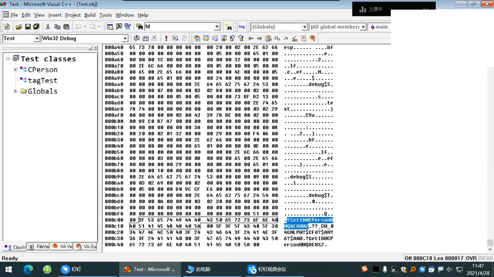

##### undname解析名称粉碎

使用everything搜索undname，打开undname所在目录，在undname所在目录下打开cmd，输入undname -f 名称粉碎之后的函数名。

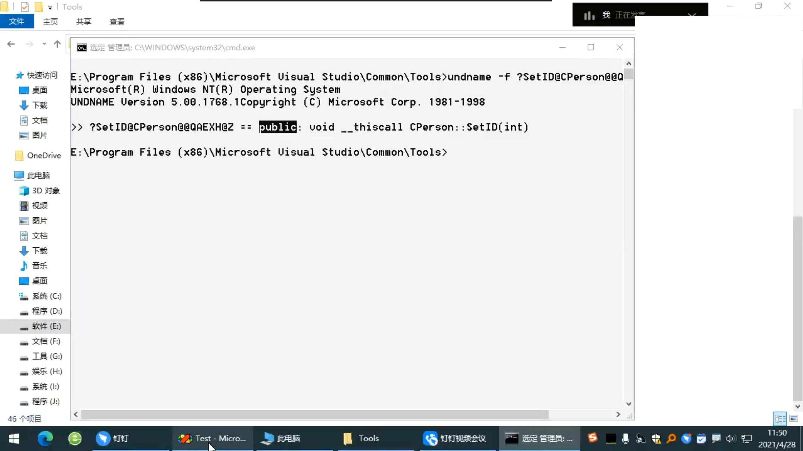

##### C/C++互调

C++使用C的名称粉碎。

```c++
extern "C" 返回值类型 调用约定 函数名(形参类型 形参名);
```

###### C调用C++

在C++的源文件中，不包含C的Test.h头文件，定义C++的函数，加extern "C"前缀。

```c++
#include <iostream>
using namespace std;

extern "C" void Fun(int n)
{
	cout << n << endl;
}
```

在C的Test.h头文件中，声明C++的函数，不加extern "C"前缀。

```c
#pragma once
void Fun(int n);
```

在C的源文件中，包含C的Test.h头文件，调用C++的函数。

```C
#include "Test.h"

int main()
{
	Fun(12345678);
	return 0;
}
```

###### C++调用C

在C的源文件中，不包含C++的Test.h头文件（，定义C的函数，不加extern "C"前缀。

```c++
#include <stdio.h>

void Fun(int n)
{
	printf("%d\r\n", n);
}
```

在C++的Test.h头文件中，声明C的函数，加extern "C"前缀。

```c
#pragma once
extern "C" void Fun(int n);
```

在C++的源文件中，包含C++的Test.h头文件，调用C的函数。

```C
#include "Test.h"

int main()
{
	Fun(12345678);
	return 0;
}
```

##### 函数重载

作用域、名称相同，参数（个数、类型、顺序）不同的函数构成函数重载，不考虑返回值类型和调用约定。

使用名称粉碎实现函数重载。

在调用有函数重载的函数时，

实参先尝试精确匹配形参，调用函数，再尝试模糊匹配形参，调用函数。

好的写法，实参精确匹配形参或者实参使用强制类型转换为形参。

```c++
#include <iostream>
using namespace std;

class CTest
{
public:
	void Set(int n);    // 函数重载
	void Set(double d); // 函数重载
	int Get();

private:
	int m_n;
};

void CTest::Set(int n)
{
	m_n = n;
}

void CTest::Set(double d)
{
	m_n = d;
}

int CTest::Get()
{
	return m_n;
}

int main()
{
	CTest test;
	test.Set(12345678); // void Set(int n);
	cout << test.Get() << endl;
	test.Set(3.14);     // void Set(double d);
	cout << test.Get() << endl;

	return 0;
}
```

如果模糊匹配到多个结果就报错。

```c++
#include <iostream>
using namespace std;

class CTest
{
public:
	void Set();                 // 函数重载
	void Set(int n = 22222222); // 函数重载
	int Get();

private:
	int m_n;
};

void CTest::Set()
{
	m_n = 11111111;
}

void CTest::Set(int n)
{
	m_n = n;
}

int CTest::Get()
{
	return m_n;
}

int main()
{
	CTest test;
	// test.Set(); // 报错，error C2668: “CTest::Set”: 对重载函数的调用不明确
	// cout << test.Get() << endl;

	return 0;
}
```

##### 函数默认参数

在函数声明的参数列表从右向左依次给默认参数。

在函数定义不加默认参数。

在调用函数时，如果有实参就使用实参，没有实参就使用默认参数。

```c++
#include <iostream>
using namespace std;

class CTest
{
public:
	void Set(int n = 12345678); // 函数默认参数
	int Get();

private:
	int m_n;
};

void CTest::Set(int n)
{
	m_n = n;
}

int CTest::Get()
{
	return m_n;
}

int main()
{
	CTest test;
	test.Set();
	cout << test.Get() << endl;

	return 0;
}
```

##### cin和cout

C++设计cin、cout、cerr、clog，替代C的stdin、stdout、stderr。

包含iostream头文件，声明命名空间std，使用cin和cout输入输出。

```c++
#include <iostream>
using namespace std;
```

```c++
#include <iostream>
using namespace std;

int main()
{
	cout << "Hello world!" << endl; // 输出

	return 0;
}
```

在VC++6.0，包含老版本的iostream.h头文件，源码可读性好，便于研究。

```c++
#include <iostream.h>
```

endl的实现原理，通过函数指针调用endl函数，endl函数输出回车，调用flush函数。

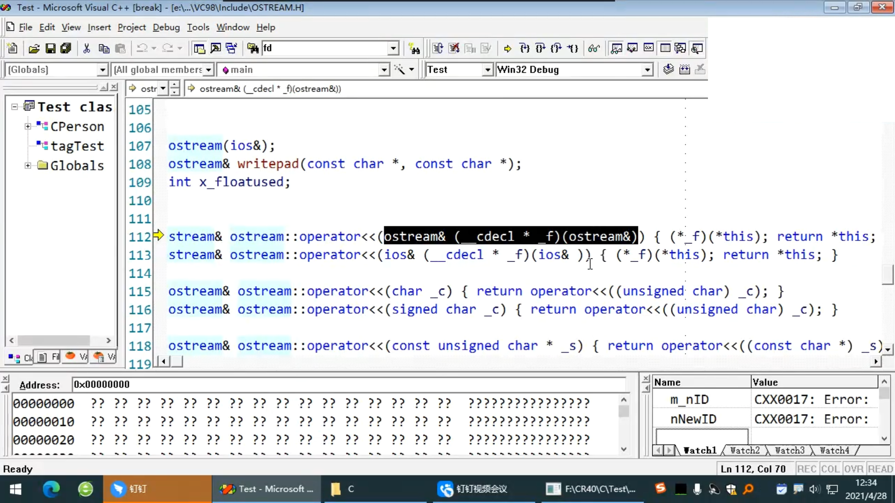

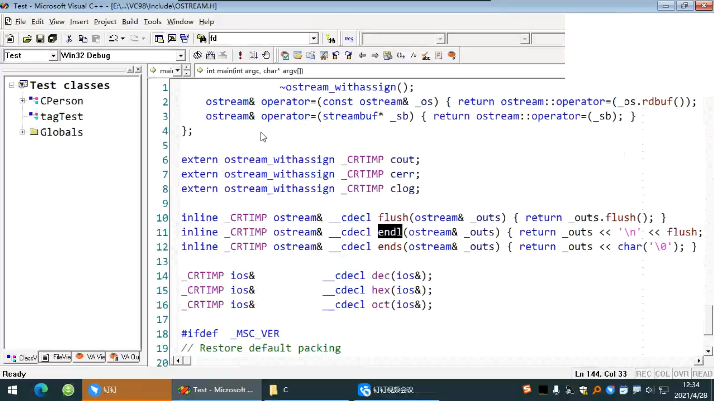

##### 运算符重载

运算符当作函数使用。

```c++
#include <iostream>
using namespace std;

int main()
{
	cout << 12345678 << endl;                   // 运算符形式
	cout.operator<<(12345678).operator<<(endl); // 函数形式

	return 0;
}
```

##### 构造和析构函数

在对象生命周期开始之后，调用构造函数初始化，函数名和类名相同，无返回值，可以重载。
在对象生命周期结束之前，调用析构函数反初始化，函数名在类名之前加波浪号，无返回值， 不可以重载。

**（备忘）**
**在构造函数中所有指针初始为NULL。**
**在成员函数开头检查所有用到的指针，在调用【和指针相关的函数】之后检查指针。**

```c++
#include <iostream>
using namespace std;

class CTest
{
public:
	CTest();      // 无参构造（默认构造）
	CTest(int n); // 有参构造
	~CTest();     // 析构
	void Set(int n);
	int Get();

private:
	int m_n;
};

CTest::CTest()
{
	m_n = 0;
}

CTest::CTest(int n)
{
	m_n = n;
}

CTest::~CTest()
{
	m_n = 0;
}

void CTest::Set(int n)
{
	m_n = n;
}

int CTest::Get()
{
	return m_n;
}

int main()
{
	CTest test(12345678);
	cout << test.Get() << endl;

	return 0;
}
```

不推荐显式调用构造和析构函数，重复使用一个对象的空间。

```c++
#include <iostream>
using namespace std;

class CTest
{
public:
	CTest();
	CTest(int n);
	~CTest();
	void Set(int n);
	int Get();

private:
	int m_n;
};

CTest::CTest()
{
	m_n = 0;
}

CTest::CTest(int n)
{
	m_n = n;
}

CTest::~CTest()
{
	m_n = 0;
}

void CTest::Set(int n)
{
	m_n = n;
}

int CTest::Get()
{
	return m_n;
}

int main()
{
	CTest test;
	test.CTest::CTest(12345678); // 手动调用构造
	cout << test.Get() << endl;
	test.~CTest();				 // 手动调用析构

	return 0;
}
```

调用构造的不同写法。

```c++
#include <iostream>
using namespace std;

class CTest
{
public:
	CTest();
	CTest(int n);
	~CTest();
	void Set(int n);
	int Get();

private:
	int m_n;
};

CTest::CTest()
{
	m_n = 0;
}

CTest::CTest(int n)
{
	m_n = n;
}

CTest::~CTest()
{
	m_n = 0;
}

void CTest::Set(int n)
{
	m_n = n;
}

int CTest::Get()
{
	return m_n;
}

int main()
{
	CTest testA(11111111);	    // 推荐
	CTest testB{ 22222222 };    // 推荐
	CTest testC = 33333333;     // 不推荐，使用了隐式类型转换
	CTest testD = (44444444);   // 不推荐，使用了隐式类型转换
	CTest testE = { 55555555 }; // 不推荐，使用了隐式类型转换

	cout << testA.Get() << endl;
	cout << testB.Get() << endl;
	cout << testC.Get() << endl;
	cout << testD.Get() << endl;
	cout << testE.Get() << endl;

	return 0;
}
```

先执行成员类对象的构造函数体。

先定义的对象，

先调用构造函数，

后调用析构函数。

```c++
#include <iostream>
using namespace std;

class CTestA
{
public:
	CTestA();
	~CTestA();
};

CTestA::CTestA()
{
	cout << "CTestA::CTestA()" << endl;
}

CTestA::~CTestA()
{
	cout << "CTestA::~CTestA()" << endl;
}

class CTestB
{
public:
	CTestB();
	~CTestB();
private:
	CTestA testa;
};

CTestB::CTestB()
{
	cout << "CTestB::CTestB()" << endl;
}

CTestB::~CTestB()
{
	cout << "CTestB::~CTestB()" << endl;
}

int main()
{
	CTestB testb;

	return 0;
}

// CTestA::CTestA()
// CTestB::CTestB()
// CTestB::~CTestB()
// CTestA::~CTestA()
```

##### 定义变量

```c++
变量类型 变量名;
变量类型 变量名 = 初始值;
变量类型 变量名 = 变量类型的构造函数(初始值);   // 变量类型的构造函数的名字 和 变量类型 相同
变量类型 变量名 = 变量类型的构造函数{ 初始值 }; // 变量类型的构造函数的名字 和 变量类型 相同
变量类型 变量名(初始值);
变量类型 变量名{ 初始值 };
```

##### this指针

指向调用成员函数的类对象。

成员函数的调用约定是__thiscal，不推荐修改调用约定。

在调用成员函数时，通过ecx寄存器向成员函数传入this指针。

不能修改this指针的指向。

```c++
#include <iostream>
using namespace std;

class CTest
{
public:
	CTest(/*CTest* const this*/);
	CTest(/*CTest* const this ,*/int n);
	~CTest(/*CTest* const this*/);
	void Set(/*CTest* const this ,*/int n);
	int Get(/*CTest* const this*/);

private:
	int m_n;
};

CTest::CTest(/*CTest* const this*/)
{
	this->m_n = 0;
}

CTest::CTest(/*CTest* const this ,*/int n)
{
	this->m_n = n;
}

CTest::~CTest(/*CTest* const this*/)
{
	this->m_n = 0;
}

void CTest::Set(/*CTest* const this ,*/int n)
{
	this->m_n = n;
}

int CTest::Get(/*CTest* const this*/)
{
	return this->m_n;
}

int main()
{
	CTest test;                 // CTest(&test)
	test.Set(12345678);         // Set(&test, 12345678)
	cout << test.Get() << endl; // Get(&test)

	return 0;
}
```

##### new和delete

取代C的malloc和free函数。

new内部调用malloc函数申请空间，申请成功之后自动调用合适的构造函数。
delete内部调用析构函数，调用free函数释放空间。

可以使用运算符重载自定义行为。

new类数组，在类数组首地址之前4字节存放数组的元素个数，
delete[] 类数组，先取出元素个数，再delete。

```c++
类型* p = NULL;
p = new 类型;
delete p;

类型* p = NULL;
p = new 类型(构造函数参数);
delete p;

类型* p = NULL;
p = new 类型[元素个数];
delete p;

类型* p = NULL;
p = new 类型[元素个数]{ 构造函数参数 };
delete p;
```

```c++
#include <iostream>
using namespace std;

class CTest
{
public:
	CTest();
	CTest(int n);
	~CTest();
	void Set(int n);
	int Get();

private:
	int m_n;
};

CTest::CTest()
{
	m_n = 0;
}

CTest::CTest(int n)
{
	m_n = n;
}

CTest::~CTest()
{
	m_n = 0;
}

void CTest::Set(int n)
{
	m_n = n;
}

int CTest::Get()
{
	return m_n;
}

int main()
{
	CTest* ptestA = NULL;
	CTest* ptestB = NULL;
	CTest* ptestC = NULL;
	CTest* ptestD = NULL;

	ptestA = new CTest();                        // 无参构造
	ptestB = new CTest(11111111);                // 有参构造
	ptestC = new CTest[2];                       // 无参构造
	ptestD = new CTest[2]{ 22222222, 33333333 }; // 有参构造

	cout << ptestA->Get() << endl;	 // 0
	cout << ptestB->Get() << endl;	 // 11111111
	cout << ptestC->Get() << endl;	 // 0
	cout << ptestD[0].Get() << endl; // 22222222
	cout << ptestD[1].Get() << endl; // 33333333

	delete ptestA;
	delete ptestB;
	delete[] ptestC;
	delete[] ptestD;

	return 0;
}
```

##### const

修饰的变量的值不可修改，替代C的无参宏语法。

在Debug版下，
修改【const修饰的局部变量】受到编译器限制，
修改【const修饰的全局变量】受到编译器限制和操作系统限制，全局变量的地址在常量区，没有写属性。

在Release版下，
【const修饰的局部变量和全局变量】没有分配内存，直接常量折叠。

指针星号\*左面的const，表示指针认为自己指向的是常量，实际指向的不一定是常量。
指针星号\*右面的const，表示指针是常量。
常成员函数之后的const，表示this指针认为自己指向的是常量，实际指向的不一定是常量。

**（备忘）获取成员变量的成员函数应该加const。**

```c++
const 类型 变量 = 0; // 常量
类型 const 变量 = 0; // 常量

const 类型* 指针变量 = NULL;       // 指针认为自己指向的是常量
类型 const* 指针变量 = NULL;       // 指针认为自己指向的是常量
类型* const 指针变量 = NULL;       // 指针是常量
const 类型* const 指针变量 = NULL; // 指针是常量，指针认为自己指向的是常量
类型 const* const 指针变量 = NULL; // 指针是常量，指针认为自己指向的是常量

返回值类型 类名::函数名(形参类型 形参名) const // this指针认为自己指向的是常量
{
	函数体;
}
```

```c++
#include <iostream>
using namespace std;

int main()
{
	int n = 11111111;
	const int* pnA = NULL;       // 指针认为自己指向的是常量
	int const* pnB = NULL;       // 指针认为自己指向的是常量
	int* const pnC = NULL;       // 指针是常量
	const int* const pnD = NULL; // 指针是常量，指针认为自己指向的是常量
	int const* const pnE = NULL; // 指针是常量，指针认为自己指向的是常量

	pnA = &n;
	pnB = &n;
	// pnC = &n; // 报错，error C3892: “pnC”: 不能给常量赋值
	// pnD = &n; // 报错，error C3892: “pnC”: 不能给常量赋值
	// pnE = &n; // 报错，error C3892: “pnC”: 不能给常量赋值

	// *pnA = 22222222; // 报错，error C3892: “pnC”: 不能给常量赋值
	// *pnB = 33333333; // 报错，error C3892: “pnC”: 不能给常量赋值
	*pnC = 44444444;
	// *pnD = 55555555; // 报错，error C3892: “pnC”: 不能给常量赋值
	// *pnE = 66666666; // 报错，error C3892: “pnC”: 不能给常量赋值

	return 0;
}
```

高权限：指针可以修改【指向地址上的值】，

低权限指针可以赋值高权限指针，

高权限指针不可以赋值低权限指针。

```c++
#include <iostream>
using namespace std;

int main()
{
	const int* pnA1 = NULL;       // 指针认为自己指向的是常量
	int const* pnB1 = NULL;       // 指针认为自己指向的是常量
	int* const pnC1 = NULL;       // 指针是常量
	const int* const pnD1 = NULL; // 指针是常量，指针认为自己指向的是常量
	int const* const pnE1 = NULL; // 指针是常量，指针认为自己指向的是常量

	const int* pnA2 = pnB1;
	const int* pnA3 = pnC1;
	const int* pnA4 = pnD1;
	const int* pnA5 = pnE1;

	int const* pnB2 = pnA1;
	int const* pnB3 = pnC1;
	int const* pnB4 = pnD1;
	int const* pnB5 = pnE1;

	// int* const pnC2 = pnA1; // 报错，error C2440: “初始化”: 无法从“const int *”转换为“int *”
	// int* const pnC3 = pnB1; // 报错，error C2440: “初始化”: 无法从“const int *”转换为“int *”
	// int* const pnC4 = pnD1; // 报错，error C2440: “初始化”: 无法从“const int *const ”转换为“int *”
	// int* const pnC5 = pnE1; // 报错，error C2440: “初始化”: 无法从“const int *const ”转换为“int *”

	const int* const pnD2 = pnA1;
	const int* const pnD3 = pnB1;
	const int* const pnD4 = pnC1;
	const int* const pnD5 = pnE1;

	int const* const pnE2 = pnA1;
	int const* const pnE3 = pnB1;
	int const* const pnE4 = pnC1;
	int const* const pnE5 = pnD1;

	return 0;
}
```

##### VS2019类向导

项目→类向导→添加类→类名→输入类名→应用→虚函数/成员变量/方法。

##### auto

类型推导符，根据初始化值的类型推导变量类型。

```c++
#include <iostream>
using namespace std;

int main()
{
	auto n = 12345678;
	auto d = 3.14;
	cout << n << " " << d << endl;

	return 0;
}
```

##### decltype

类型推导符，根据【括号里变量的类型】推导变量的类型。

可以使用decltype关键字推导数组元素的类型。

```c++
#include <iostream>
using namespace std;

int main()
{
	auto nA = 11111111;
	auto dA = 3.14;
	cout << nA << " " << dA << endl;

	decltype(nA) nB = 22222222; // nB类型 = nA
	decltype(dA) dB = 2.71828;  // dB类型 = dA
	cout << nB << " " << dB << endl;

	return 0;
}
```

##### nullptr

赋值指针，增加可读性，取代C的NULL宏。

```c++
char* pc = nullptr;
```

##### bool、true、false

赋值bool类型变量，非0为真，0为假。

```c++
#include <iostream>
using namespace std;

int main()
{
	bool b = true;
	cout << b << endl; // 0
	b = false;
	cout << b << endl; // 1

	return 0;
}
```

##### 范围迭代

```c++
#include <iostream>
using namespace std;

int main()
{
	int an[] = { 1,2,3,4,5 };

	for (int i = 0; i < sizeof(an) / sizeof(an[0]); i++)
	{
		cout << an[i] << " ";
	}
	cout << endl;

	for (auto n:an) // n遍历数组an每一项
	{
		cout << n << " ";
	}
	cout << endl;

	return 0;
}
```

##### 命名空间和作用域运算符

为作用域取名，解决命名冲突，替代C的变量和函数的作用域前缀。

声明命名空间。

```c++
#include <iostream>
using namespace std; // 声明namespace std

namespace Test // 定义namespace Test
{
	class CTest
	{
	public:
		void Fun();

	private:
		int m_n = 12345678;
	};

	void CTest::Fun()
	{
		cout << m_n << endl; // 使用namespace std
	}
}

using namespace Test; // 声明namespace Test
 
int main()
{
	CTest test; // 使用namespace Test
	test.Fun();

	return 0;
}
```

使用作用域运算符访问命名空间。

```c++
#include <iostream>

namespace Test // 定义namespace Test
{
	class CTest
	{
	public:
		void Fun();

	private:
		int m_n = 12345678;
	};

	void CTest::Fun()
	{
		std::cout << m_n << std::endl; // 使用std::
	}
}

int main()
{
	Test::CTest test; // 使用Test::
	test.Fun();

	return 0;
}  
```

单独声明命名空间中的一个名字。

```c++
#include <iostream>
using std::cout; // 声明std::cout
using std::endl; // 声明std::endl

namespace Test // 定义namespace Test
{
	class CTest
	{
	public:
		void Fun();

	private:
		int m_n = 12345678;
	};

	void CTest::Fun()
	{
		cout << m_n << endl; // 使用std::cout和std::endl
	}
}

using Test::CTest; // 声明Test::CTest

int main()
{
	CTest test; // 使用Test::CTest
	test.Fun();

	return 0;
}  
```

一个命名空间可以写在多个文件。

```c++
#include <iostream>
using namespace std;

namespace Test // 定义namespace Test
{
	class CTest
	{
	public:
		void Fun();

	private:
		int m_n = 12345678;
	};
}

namespace Test // 定义namespace Test
{
	void CTest::Fun()
	{
		cout << m_n << endl;
	}
}

using namespace Test;

int main()
{
	CTest test;
	test.Fun();

	return 0;
}
```

声明【命名空间中的命名空间】。

```c++
#include <iostream>
using namespace std;

namespace TestA
{
	namespace TestB
	{
		int g_n = 12345678;
	}
}

using namespace TestA; // 声明namespace TestA
using namespace TestB; // 声明namespace TestB，必须先声明namespace TestA

int main()
{
	cout << g_n << endl;

	return 0;
}
```

使用作用域运算符访问【命名空间中的命名空间】。

```c++
#include <iostream>
using namespace std;

namespace TestA
{
	namespace TestB
	{
		int g_n = 12345678;
	}
}

int main()
{
	cout << TestA::TestB::g_n << endl; // 多次使用作用域运算符

	return 0;
}
```

为命名空间起别名。

```c++
#include <iostream>
using namespace std;

namespace TestA
{
	class CTest
	{
	public:
		void Fun();

	private:
		int m_n = 12345678;
	};

	void CTest::Fun()
	{
		cout << m_n << endl;
	}
}

namespace TestB = TestA; // TestB是TestA的别名
using namespace TestB;	 // 声明TestB

int main()
{
	CTest test;
	test.Fun();

	return 0;
}
```

声明两个命名空间，直接使用两个命名空间中的相同名字会报错，必须使用作用域运算符。

```c++
#include <iostream>
using namespace std;

namespace TestA
{
	int g_n = 11111111;
}
namespace TestB
{
	int g_n = 22222222;
}

using namespace TestA;
using namespace TestB;

int main()
{
	// cout << g_n << endl; // 报错，error C2872: “g_n”: 不明确的符号
	cout << TestA::g_n << endl;	// 使用作用域运算符指定作用域
	cout << TestB::g_n << endl;	// 使用作用域运算符指定作用域

	return 0;
}
```

访问全局作用域的名字。

```c++
#include <iostream>
using namespace std;

namespace Test
{
	int g_n = 11111111;
}

using namespace Test;

int g_n = 22222222;

int main()
{
	cout << g_n << endl; // 报错，error C2872: “g_n”: 不明确的符号
	cout << Test::g_n << endl; // 使用Test::g_n
	cout << ::g_n << endl;	   // 使用全局g_n

	return 0;
}
```

##### VS2019设置启动项目

项目→设为启动项目。

##### 野指针和空指针 

野指针指向无效内存。

空指针指向nullptr。

##### 引用

为变量取别名。

不能多级引用。

必须初始化。

不要使用别的类型引用某个类型变量。

不能引用常量。

不能修改引用哪个对象。

```c++
#include <iostream>
using namespace std;

int main()
{
	int nA = 12345678;
	int& nB = nA; // nB是nA的别名
	cout << nA << " " << nB << endl;

	return 0;
}
```

**（备忘）作为函数形参，形参使用&符号，实参不使用&符号**

```c++
#include <iostream>
using namespace std;

void Swap(int& nA, int& nB) // 形参使用&符号
{
	int nC = nB;
	nB = nA;
	nA = nC;
}

int main()
{
	int nA = 11111111;
	int nB = 22222222;
	Swap(nA, nB); // 实参不使用&符号
	cout << nA << " " << nB << endl;

	return 0;
}
```

**（备忘）传入类的引用（类对象的this指针可以看作引用），**

**返回类的引用（*this），可以连续调用成员函数，修改对象的值，**

**返回临时对象，可以连续调用成员函数，不修改对象的值。**

```c++
#include <iostream>
using namespace std;

class CTest
{
public:
	CTest();
	CTest(int n);
	~CTest();
	void Set(int n);
	int Get();
	CTest& Add(int n);

private:
	int m_n;
};

CTest::CTest()
{
	m_n = 0;
}

CTest::CTest(int n)
{
	m_n = n;
}

CTest::~CTest()
{
	m_n = 0;
}

void CTest::Set(int n)
{
	m_n = n;
}

int CTest::Get()
{
	return m_n;
}

CTest& CTest::Add(int n)
{
	m_n = m_n + n;
	return *this; // 返回类的引用（*this）
}

int main()
{
	CTest test;
	test.Add(1).Add(2).Add(3); // 连续调用成员函数
	cout << test.Get() << endl;

	return 0;
}
```

常量引用可以引用常量，使用常量引用和直接使用常量效果相同。

```c++
#include <iostream>
using namespace std;

int main()
{
	const int& n = 12345678; // 常量引用
	cout << n << endl;

	return 0;
}
```

为指针指向的内存取别名。

```c++
#include <iostream>
using namespace std;

int main()
{
	int nA = 12345678;
	int* pn = nullptr;
	pn = &nA;
	int& nB = *pn;

	cout << &nA << " " << nA << endl; // 0019FEDC 12345678
	cout << &nB << " " << nB << endl; // 0019FEDC 12345678

	return 0;
}
```

##### VS2019重命名变量

右键变量→重命名→新名称→输入新名词→预览→应用。

##### VS2019片段

条件编译。

选中代码→片段→外侧代码。

##### explicit

在构造函数的声明之前加explicit前缀，禁用构造函数的隐式类型转换。

```c++
class CTest
{
public:
	explicit CTest();      // 禁用隐式类型转换
	explicit CTest(int n); // 禁用隐式类型转换
	~CTest();

private:
	int m_n;
};

CTest::CTest()
{
	m_n = 0;
}

CTest::CTest(int n)
{
	m_n = n;
}

CTest::~CTest()
{
	m_n = 0;
}

int main()
{
	CTest testA(11111111);
	CTest testB{ 22222222 };
	// CTest testC = 33333333;     // 报错，error C2440: “初始化”: 无法从“int”转换为“CTest”
	// CTest testD = (44444444);   // 报错，error C2440: “初始化”: 无法从“int”转换为“CTest”
	// CTest testE = { 55555555 }; // 报错，error C3445: "CTest" 的复制列表初始化不能使用显式构造函数

	return 0;
}
```

##### 拷贝构造函数

形参必须是引用。

如果没有拷贝构造，就像memcpy函数一样直接拷贝对象内存。

如果有拷贝构造，就调用拷贝构造。

在传入对象、返回对象、手动调用时，调用拷贝构造函数。

```c++
#include <iostream>
using namespace std;

class CTest
{
public:
	CTest();
	CTest(int n);
	CTest(CTest& obj); // 拷贝构造
	~CTest();
	void Set(int n);
	int Get();

private:
	int m_n;
};

CTest::CTest()
{
	m_n = 0;
}

CTest::CTest(int n)
{
	m_n = n;
}

CTest::CTest(CTest& obj)
{
	m_n = obj.m_n;
}

CTest::~CTest()
{
	m_n = 0;
}

void CTest::Set(int n)
{
	m_n = n;
}

int CTest::Get()
{
	return m_n;
}

int main()
{
	CTest testA(12345678); // 有参构造
	CTest testB(testA);    // 拷贝构造

	cout << testA.Get() << endl;
	cout << testB.Get() << endl;

	return 0;
}
```

使用private关键字私有拷贝构造，在类外禁用拷贝构造。

```c++
#include <iostream>
using namespace std;

class CTest
{
public:
	CTest();
	CTest(int n);
	~CTest();
	void Set(int n);
	int Get();

private:
	CTest(CTest& obj); // 拷贝构造
	int m_n;
};

CTest::CTest()
{
	m_n = 0;
}

CTest::CTest(int n)
{
	m_n = n;
}

CTest::CTest(CTest& obj)
{
	m_n = obj.m_n;
}

CTest::~CTest()
{
	m_n = 0;
}

void CTest::Set(int n)
{
	m_n = n;
}

int CTest::Get()
{
	return m_n;
}

int main()
{
	CTest testA(12345678); // 有参构造
	// CTest testB(testA); // 报错，error C2248: “CTest::CTest”: 无法访问 private 成员(在“CTest”类中声明)

	cout << testA.Get() << endl;
	// cout << testB.Get() << endl;

	return 0;
}
```

##### = delete

在成员函数的声明之后加= delete后缀禁用这个成员函数。

```c++
#include <iostream>
using namespace std;

class CTest
{
public:
	CTest();
	CTest(int n);
	CTest(CTest& obj) = delete; // 禁用拷贝构造
	~CTest();
	void Set(int n);
	int Get();

private:
	int m_n;
};

CTest::CTest()
{
	m_n = 0;
}

CTest::CTest(int n)
{
	m_n = n;
}

CTest::CTest(CTest& obj)
{
	m_n = obj.m_n;
}

CTest::~CTest()
{
	m_n = 0;
}

void CTest::Set(int n)
{
	m_n = n;
}

int CTest::Get()
{
	return m_n;
}

int main()
{
	CTest testA(12345678);
	// CTest testB(testA); // 报错，error C2280: “CTest::CTest(CTest &)”: 尝试引用已删除的函数

	cout << testA.Get() << endl;
	// cout << testB.Get() << endl;

	return 0;
}
```

##### 无名对象

没有名字，不能再次使用，像printf函数的格式化字符串一样。

生命周期在本条语句。

##### VS2019删除新建项目历史路径

只能修复。

##### CMyString

（字符串操作类）

**（备忘）**

**函数的重复操作可以调用已实现函数实现。**

**函数的主干流程按照正常情况写，中间判断不正常情况，进行对应处理，能回到主流程就继续，不能就返回。**

**不能多次手动调用构造函数。**

复制操作，原数据消失，原数据没用。如果复制失败，不保留原数据。

追加操作，原数据组成了新字符串，原数据有用。如果追加失败，保留原数据。

```c++
class CMyString
{
private:
	// 置零{ 所有成员变量初始化为0 }

	// 清理{ 检查指针，释放资源，调用置零函数 }

public:
	// 无参构造{ 调用置零函数 }

	// 有参构造{ 检查传入指针（nullptr，调用置零函数，返回），
	// 申请空间（nullptr，调用置零函数，返回），
	// 拷贝字符串，修改成员变量 }

	// 拷贝构造{ 调用有参构造函数 }

	// 析构{ 调用清理函数 }

	// 取字符串地址{ 返回成员变量 }

	// 取字符串长度{ 返回成员变量 }

	// 复制{ 检查成员指针（!nullptr，调用清理函数），
	// 检查传入指针（nullptr，返回），
	// 拷贝字符串，修改成员变量 }

	// 追加{ 检查成员指针（nullptr，调用复制函数，返回*this），
	// 检查传入指针（nullptr，返回*this），
	// 检查缓冲区长度（不够，使用临时指针申请空间（失败，返回*this）），
	// 使用临时指针拷贝原来的字符串，使用临时指针追加新字符串，记录临时变量，调用清理函数，
	// 使用临时指针赋值成员指针，使用临时变量赋值成员变量，返回*this }
	
	// 追加类对象{ 调用追加函数 }
	
	// 追加整型{ 定义临时字符串，判断不同的转换进制，调用sprintf函数向临时字符串写入格式化字符串，调用追加函数 }
	
	// 追加浮点
	
	// 追加字符
	
	// 比较
	
	// 比较类对象
	
	// 替换（替换开始下标，替换长度，要替换成的字符串地址）
	
	// 替换类对象（替换开始下标，替换长度，要替换成的类对象地址）
	
	// 返回找到字符串下标或-1 查找
	// 返回找到字符串下标或-1 查找类对象
	// 返回找到字符串下标或-1 反向查找
	// 返回找到字符串下标或-1 反向查找类对象
	
	// 从左提取子串（提取长度）
	// 从中间提取子串（提取开始下表，提取长度）
	// 从右提取子串（提取长度）
	
	// 格式化{ 检查成员指针（!nullptr，调用清理函数），
	// 检查传入指针（nullptr，调用置零函数，返回），
	// 定义临时字符串，调用sprintf函数向临时字符串写入格式化字符串，调用复制函数 }

private:
	// 字符串地址
	// 字符串长度
	// 缓冲区大小
};
```

##### CMyString应用

通过文件全路径，获取盘符，文件路径，文件名，后缀名。

盘符：从左提取子串。

文件夹路径：反向查找\字符，从左提取子串。

文件名：反向查找\字符，从中间提取子串。

扩展名：反向查找.字符，从左提取子串。

##### VS2019快速操作和重构

选中代码→快速操作和重构→更改签名→添加/溢出/修改→确定→确定→应用。

选中代码→快速操作和重构→提取函数→新函数/方法名称(N):→输入函数名→确定。

选中成员函数声明右键→快速操作和重构→创建定义。

##### sprintf函数

sprintf函数写入内存，其他和printf函数效果相同。

```c
// 向字符串写入格式字符串
// 返回写入字符串长度
int sprintf(
	char* buffer, 	   // 写入的字符串地址
	const char* format // 格式字符串地址
	[, argument] ...   // 参数
);

#include <stdio.h>
```

##### VS2019文本可视化工具

在调试时，点击变量下面的三角。

##### 初始化列表

在【构造函数的定义的参数列表】之后写初始化列表。

成员常量只能使用初始化列表初始化。（在成员变量定义处直接初始化？）

成员类对象只能使用初始化列表，调用指定构造函数。（在成员变量定义处直接初始化？）

在运行时按照【定义成员变量顺序】初始化。

会屏蔽【在成员变量定义处的赋值】。

```c++
class CTestA
{
public:
	CTestA();
	~CTestA();

private:
	int m_nA = 11111111; // 屏蔽
};

CTestA::CTestA() : // 初始化列表
	m_nA(22222222)       // 5
{                        // 4
	m_nA = 33333333;     // 6
}

CTestA::~CTestA()
{                        // 10
	m_nA = 44444444;     // 11
}

class CTestB
{
public:
	CTestB();
	~CTestB();

private:
	int m_nB = 55555555; // 屏蔽
	CTestA testa;
};

CTestB::CTestB() : // 初始化列表
	m_nB(66666666),      // 2
	testa()				 // 3
{                        // 1
	m_nB = 77777777;     // 7
}

CTestB::~CTestB()
{                        // 8
	m_nB = 88888888;     // 9
}

int main()
{
	CTestB testb;

	return 0;
}
```

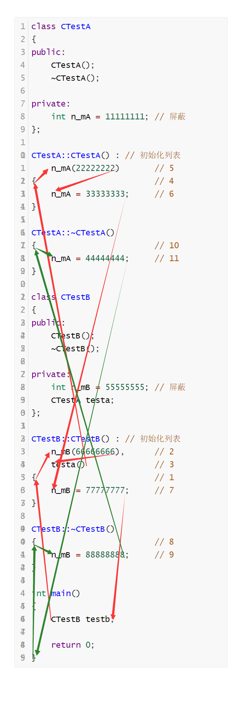

##### 在成员变量定义处直接初始化

```c++
class CTestA
{
public:
	CTestA();
	~CTestA();

private:
	int m_nA = 11111111; // 5
};

CTestA::CTestA() // :
	// m_nA(22222222)
{                        // 4
	m_nA = 33333333;     // 6
}

CTestA::~CTestA()
{                        // 10
	m_nA = 44444444;     // 11
}

class CTestB
{
public:
	CTestB();
	~CTestB();

private:
	int m_nB = 55555555; // 2
	CTestA testa;
};

CTestB::CTestB() // :
	// m_nB(66666666),
	// testa()
{                        // 1 3
	m_nB = 77777777;     // 7
}

CTestB::~CTestB()
{                        // 8
	m_nB = 88888888;     // 9
}

int main()
{
	CTestB testb;

	return 0;
}
```

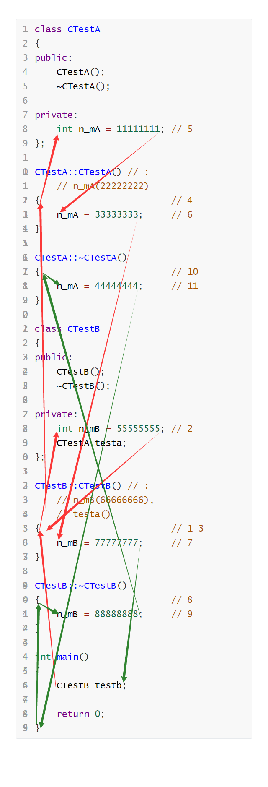

##### 静态成员变量

一个类所有类对象共用的成员变量，替换C的全局变量。

在类内静态成员变量声明之前加static前缀，

在类外静态成员变量定义之前不加static前缀。

使用作用域运算符访问静态成员变量。

不在类成员变量结构体中，在全局数据区中。

生命周期和全局变量相同。

```c++
#include <iostream>
using namespace std;

class CTest
{
public:
	static int m_n; // 声明静态成员变量
};

int CTest::m_n;     // 定义静态成员变量

int main()
{
	CTest::m_n = 12345678;
	cout << CTest::m_n << endl; // 使用静态成员变量

	return 0;
}
```

##### 静态成员函数

只能访问静态成员变量的成员函数。

在静态成员函数的声明之前加static前缀。

在静态成员函数的定义之前不加static前缀。

使用作用域运算符调用静态成员函数。

```c++
#include <iostream>
using namespace std;

class CTest
{
public:
	static void Set(int n); // 静态成员函数
	static int Get();       // 静态成员函数

private:
	static int m_n;         // 声明静态成员变量
};

int CTest::m_n;             // 定义静态成员变量

void CTest::Set(int n)
{
	m_n = n;
}

int CTest::Get()
{
	return m_n;
}

int main()
{
	CTest::Set(12345678);
	cout << CTest::Get() << endl;

	return 0;
}
```

##### 友元

可以访问类私有成员。

在类内写友元类/函数/成员函数声明，在声明之前加friend前缀。

不推荐使用，会破坏封装性。

###### 友元类

友元类CTestB，可以有【CTestA类对象】和【CTestA类对象指针】作为成员变量。

可以通过传入引用修改实参。

```c++
class CTestA // CTestA定义
{
public:
	friend class CTestB; // CTestB是CTestA的友元

private:
	int m_n;
};

class CTestB
{
public:
	void Fun(CTestA& testa); // 提供友元类的成员函数声明，需要CTestA声明

private:
	CTestA m_testa;   // 定义类对象，需要CTestA定义
	CTestA* m_ptesta; // 定义类对象指针，需要CTestA声明
};

void CTestB::Fun(CTestA& testa) // 提供友元类的成员函数定义，需要CTestA定义
{
	m_testa.m_n;   // 友元类的成员函数访问成员类对象
	m_ptesta->m_n; // 友元类的成员函数访问成员类对象指针
	testa.m_n;	   // 友元类的成员函数访问传入的类对象
}

int main()
{
	return 0;
}
```

声明只可以满足需要声明的需求，

定义可以满足需要声明和定义的需求。

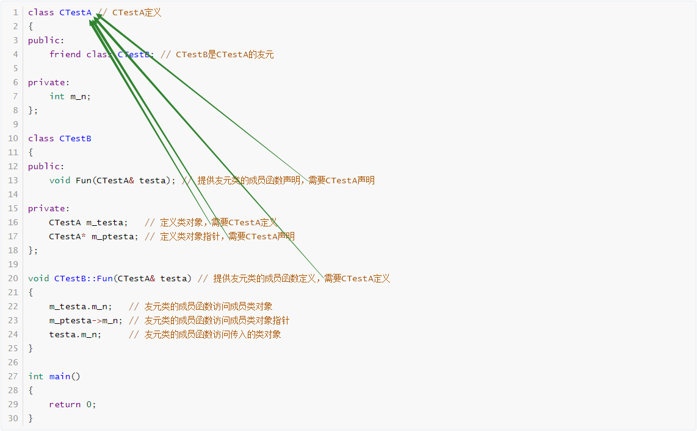

###### 友元成员函数

所在类CTestB，只能有【CTestA类对象指针】作为成员变量。

可以通过传入引用修改实参。

```c++
class CTestA; // 提供CTestA声明

class CTestB
{
public:
	void Fun(CTestA& testa); // 提供友元成员函数声明，需要CTestA声明

private:
	// CTestA m_testa; // 报错，error C2079: “CTestB::m_testa”使用未定义的 class“CTestA”
	// 定义类对象，需要CTestA定义
	CTestA* m_ptesta; // 定义类对象指针，需要CTestA声明
};

class CTestA // CTestA定义
{
public:
	friend void CTestB::Fun(CTestA& testa); // CTestB::Fun()是CTestA的友元，需要友元成员函数声明

private:
	int m_n;
};

void CTestB::Fun(CTestA& testa) // 提供友元成员函数定义，需要CTestA定义
{
	m_ptesta->m_n; // 友元成员函数访问成员类对象指针
	testa.m_n;	   // 友元成员函数访问传入的类对象
}

int main()
{
	return 0;
}
```

声明只可以满足需要声明的需求，

定义可以满足需要声明和定义的需求。

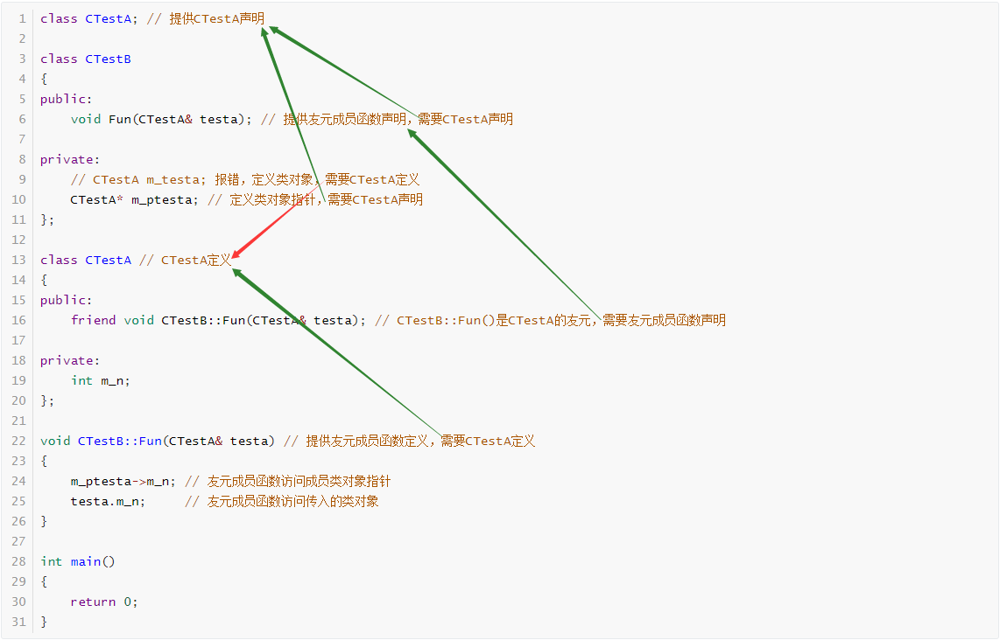

###### 友元函数

可以在类内写友元函数定义，在类外写友元函数声明，

可以在类内写友元函数声明，在类外写友元函数定义。

```c++
class CTest // 提供CTest定义
{
public:
	friend void Fun(CTest& test); // Fun是CTestA的友元

private:
	int m_n;
};

void Fun(CTest& test) // 提供友元类函数定义，需要CTestA定义
{
	test.m_n; // 友元员函数访问成员类对象
}

int main()
{
	return 0;
}
```

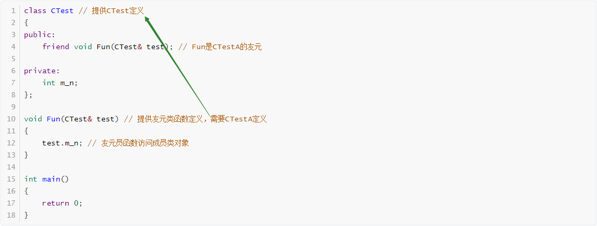

##### VA自动添加Set和Get函数

右键成员变量→Quick Actions and Refactorings (VA)→Encapsulate Field→Getter name (or empty):
Setter name (or empty):→输入Set和Get函数名称→OK。

##### 嵌套类

内部类可以访问外部类的私有成员函数和变量，

外部类不可以访问内部类的私有成员函数和变量。

```c++
#include <iostream>
using namespace std;

class CTestA // 外部类
{
public:
	class CTestB // 内部类
	{
	public:
		void Set(int n);
		int Get();
		void Fun();

	private:
		int m_nB;
	}testb;
	void Set(int n);
	int Get();
	void Fun();

private:
	int m_nA;
};

void CTestA::Set(int n)
{
	m_nA = n;
}

int CTestA::Get()
{
	return m_nA;
}

void CTestA::Fun()
{
	m_nA;
	// testb.m_nB; // 报错，error C2248: “CTestA::CTestB::m_nB”: 无法访问 private 成员(在“CTestA::CTestB”类中声明)
}

void CTestA::CTestB::Set(int n)
{
	m_nB = n;
}

int CTestA::CTestB::Get()
{
	return m_nB;
}

void CTestA::CTestB::Fun()
{
	// m_nA; // 报错，error C2327: “CTestA::m_nA”: 不是类型名称、静态或枚举数
	m_nB;
}

int main()
{
	CTestA::CTestB testb;
	testb.Set(12345678);
	cout << testb.Get() << endl;

	return 0;
}
```

##### github教程

**（备忘）**[一看就懂！Github基础教程_哔哩哔哩_bilibili](https://www.bilibili.com/video/BV1hS4y1S7wL?from=search&seid=4252192833580395339&spm_id_from=333.337.0.0)

##### 原生字符串

不进行转义的字符串。

```c++
#include <iostream>
using namespace std;

int main()
{
	cout << R"(Hello world!\r\n)" << endl; // Hello world!\r\n

	return 0;
}
```

##### 断言

（assert）在Debug版下，如果表达式为假，就报错。可以检查参数。

```c++
#include <assert.h>

int main(int argc)
{
	assert(argc == 0);

	return 0;
}
```

##### VS2019设置命令行参数

项目→属性→调试→命令参数→输入命令行参数。

##### 深拷贝和浅拷贝

一个指针指向一个字符串。

浅拷贝：新指针复制老指针的值，两个指针指向同一块内存。省内存，效率高。

深拷贝：新指针重新申请内存，新指针指向的内存复制老指针指向的内存，两个指针指向不同的内存。耗内存，效率低。

##### （拷贝构造时浅拷贝）写时（深）拷贝和引用计数

在资源中记录正在使用资源的对象数量。

在拷贝构造时使用浅拷贝，增加计数。

在析构时减少计数，如果计数减为0，就释放资源。

在对象修改资源时使用深拷贝，在新资源中重新记录使用新资源的对象数量。

```c++
class CBuffer
{
public:
	// 默认构造{ 调用置零函数 }
	CBuffer();
	// 拷贝构造{ 检查传入指针（nullptr，调用置零函数，返回），使用参数变量赋值成员变量，增加引用计数 }
	CBuffer(const CBuffer& obj);
	// 析构{ 调用减少引用计数函数 }
	~CBuffer();
	// 深拷贝{ 调用减少引用计数函数，检查传入指针（nullptr，调用置零函数，返回），
	// 使用成员指针申请新空间，检查成员指针（nullptr，调用置零函数，返回），
	// 从参数指针地址向成员指针地址拷贝内存，使用参数变量赋值成员变量 }
	void Set(const char* pBuff, int nSize);
	// 获取Buffer地址
	char* GetBuffer()const;
	// 获取Buffer大小
	int GetSize()const;

private:
	// 置零{ 所有成员变量置零 }
	void SetZero();
	// 清理{ 检查所有成员指针（nullptr，释放资源），调用置零函数 }
	void Clear();
	// 减少引用计数{ 检查所有成员指针（nullptr，返回），减少引用计数，检查引用计数（0，调用清理函数） }
	void DecRefCnt();

private:
	char* m_pcBuffer; // Buffer地址
	int m_nSize;	  // Buffer大小
	int* m_pnRefCnt;  // 引用计数
};
```

```c++
#include <string.h>

class CBuffer
{
public:
	// 默认构造{ 调用置零函数 }
	CBuffer();
	// 拷贝构造{ 检查传入指针（nullptr，调用置零函数，返回），使用参数变量赋值成员变量，增加引用计数 }
	CBuffer(const CBuffer& obj);
	// 析构{ 调用减少引用计数函数 }
	~CBuffer();
	// 深拷贝{ 调用减少引用计数函数，检查传入指针（nullptr，调用置零函数，返回），
	// 使用成员指针申请新空间，检查成员指针（nullptr，调用置零函数，返回），
	// 从参数指针地址向成员指针地址拷贝内存，使用参数变量赋值成员变量 }
	void Set(const char* pBuff, int nSize);
	// 获取Buffer地址
	char* GetBuffer()const;
	// 获取Buffer大小
	int GetSize()const;

private:
	// 置零{ 所有成员变量置零 }
	void SetZero();
	// 清理{ 检查所有成员指针（nullptr，释放资源），调用置零函数 }
	void Clear();
	// 减少引用计数{ 检查所有成员指针（nullptr，返回），减少引用计数，检查引用计数（0，调用清理函数） }
	void DecRefCnt();

private:
	char* m_pcBuffer; // Buffer地址
	int m_nSize;	  // Buffer大小
	int* m_pnRefCnt;  // 引用计数
};

CBuffer::CBuffer()
{
	// 调用置零函数
	SetZero();
}

CBuffer::CBuffer(const CBuffer& obj)
{
	// 	检查传入指针nullptr
	if (obj.m_pcBuffer == nullptr || obj.m_pnRefCnt == nullptr)
	{
		// 调用置零函数
		SetZero();

		// 返回
		return;
	}

	// 使用参数变量赋值成员变量
	m_pcBuffer = obj.m_pcBuffer;
	m_nSize = obj.m_nSize;
	m_pnRefCnt = obj.m_pnRefCnt;

	// 增加引用计数
	*(obj.m_pnRefCnt) = *(obj.m_pnRefCnt) + 1;
}

CBuffer::~CBuffer()
{
	// 调用减少引用计数函数
	DecRefCnt();
}

// 深拷贝{ 调用减少引用计数函数，检查传入指针（nullptr，调用置零函数，返回），
// 使用成员指针申请新空间，检查成员指针（nullptr，调用置零函数，返回），
// 从参数指针地址向成员指针地址拷贝内存，使用参数变量赋值成员变量 }

void CBuffer::Set(const char* pBuff, int nSize)
{
	// 调用减少引用计数函数
	DecRefCnt();

	// 检查传入指针nullptr
	if (pBuff == nullptr)
	{
		// 调用置零函数
		SetZero();

		// 返回
		return;
	}

	// 使用成员指针申请新空间
	m_pcBuffer = new char[nSize];
	m_pnRefCnt = new int(1);

	// 检查成员指针nullptr
	if (m_pcBuffer == nullptr)
	{
		// 调用置零函数
		SetZero();

		// 返回
		return;
	}

	// 从参数指针地址向成员指针地址拷贝内存
	memcpy(m_pcBuffer, pBuff, nSize);

	// 使用参数变量赋值成员变量
	m_nSize = nSize;
}

char* CBuffer::GetBuffer() const
{
	// 获取Buffer地址
	return m_pcBuffer;
}

int CBuffer::GetSize() const
{
	// 获取Buffer大小
	return m_nSize;
}

void CBuffer::SetZero()
{
	// 所有成员变量置零
	m_pcBuffer = nullptr;
	m_nSize = 0;
	m_pnRefCnt = nullptr;
}

void CBuffer::Clear()
{
	// 检查所有成员指针nullptr
	if (m_pcBuffer != nullptr)
	{
		// 释放资源
		delete[] m_pcBuffer;
	}
	if (m_pnRefCnt != nullptr)
	{
		// 释放资源
		delete m_pnRefCnt;
	}

	// 调用置零函数
	SetZero();
}

void CBuffer::DecRefCnt()
{
	// 检查所有成员指针nullptr
	if (m_pcBuffer == nullptr || m_pnRefCnt == nullptr)
	{
		// 返回
		return;
	}

	// 减少引用计数
	*m_pnRefCnt = *m_pnRefCnt - 1;

	// 检查引用计数0
	if (*m_pnRefCnt == 0)
	{
		// 调用清理函数
		Clear();
	}
}

int main()
{
	CBuffer bufferA;
	bufferA.Set("ABC", 4);

	CBuffer bufferB(bufferA);

	CBuffer bufferC(bufferA);
	bufferC.Set("DEF", 4);

	return 0;
}
```

##### basic_fstream类

```c++
// 开文件
void open(
	const char* filename,								   // 文件名字符串
	ios_base::openmode mode = ios_base::in | ios_base::out // 打开模式，ios::binary | ios::in | ios::out二进制读写打开文件，ios::binary | ios::in | ios::out | ios::trunc二进制读写创建文件
);

// 检查开文件成功失败
// 成功返回ture，失败返回false
bool is_open();

// 移动文件写指针
fstream::basic_ostream& seekp(
	fstream::off_type off, 	   // 移动位移
	std::ios_base::seekdir dir // 移动起点，beg文件开始，end当前位置，cur文件结尾
);

// 获取文件写指针相对文件开头位置
// 成功返回文件写指针位置，失败返回fstream::pos_type类型的-1
fstream::pos_type tellp();

// 写文件
fstream::basic_ostream& write(
	const fstream::char_type* s, // 存放写入内容的地址
	std::streamsize count        // 写大小
);

// 存文件
fstream::basic_ostream& flush();

// 移动文件读指针
fstream::basic_istream& seekg(
	fstream::off_type off, 	   // 移动位移
	std::ios_base::seekdir dir // 移动起点，ios::beg文件开始，ios::cur当前位置，ios::end文件结尾
);

// 获取文件读指针相对文件开头位置
// 成功返回文件读指针位置，失败返回fstream::pos_type类型的-1
fstream::pos_type tellg();

// 读文件
fstream::basic_istream& read(
	fstream::char_type* s, // 存放读出内容的地址
	std::streamsize count  // 读大小
);

// 关文件
void close();

#include <fstream>
using namespace std;
fstream fstreamA;
fstreamA.open(filename, mode)
fstreamA.is_open()
fstreamA.seekp(off, ios::beg)
fstreamA.tellp()
fstreamA.write(s, count)
fstreamA.flush()
fstreamA.seekg(off, ios::beg)
fstreamA.tellg()
fstreamA.read(s, count)
fstreamA.close()
```

二进制模式。

```c++
#include <fstream>
#include <iostream>
using namespace std;

int main()
{
	fstream fstreamA;
	char sz[] = "Hello world!";
	fstream::pos_type pos_typeA = 0;
	char* pc = nullptr;

	// 开文件
	fstreamA.open("Test.bin", ios::binary | ios::in | ios::out);
	if (!fstreamA.is_open())
	{
		// 创建文件
		fstreamA.open("Test.bin", ios::binary | ios::in | ios::out | ios::trunc);
		if (!fstreamA.is_open())
		{
			cout << "open失败" << endl;
			goto END;
		}
	}

	// 移动文件写指针到文件开头
	fstreamA.seekp(0, ios::beg);

	// 写文件
	fstreamA.write(sz, sizeof(sz));

	// 存文件
	fstreamA.flush();

	// 移动文件读指针到文件结尾
	fstreamA.seekg(0, ios::end);

	// 获取文件大小
	pos_typeA = fstreamA.tellg();

	// 申请堆内存
	pc = new char[pos_typeA] {0};
	if (pc == nullptr)
	{
		goto END;
	}

	// 移动文件读指针到文件开头
	fstreamA.seekg(0, ios::beg);

	// 读文件
	fstreamA.read(pc, pos_typeA);

	// 显示读入字符串
	cout << pc << endl;

END:
	// 关文件
	fstreamA.close();

	// 释放堆内存
	if (pc != NULL)
	{
		free(pc);
		pc = NULL;
	}

	return 0;
}
```

文本模式。

```c++
#include <fstream>
#include <iostream>
using namespace std;

int main()
{
	fstream fstreamA;
	int n = 0;
	double d = 0.;
	char sz[16] = { 0 };

	// 开文件
	fstreamA.open("Test.bin", ios::binary | ios::in | ios::out);
	if (!fstreamA.is_open())
	{
		// 创建文件
		fstreamA.open("Test.bin", ios::binary | ios::in | ios::out | ios::trunc);
		if (!fstreamA.is_open())
		{
			cout << "open失败" << endl;
			goto END;
		}
	}

	// 移动文件写指针到文件开头
	fstreamA.seekp(0, ios::beg);

	// 写文件
	fstreamA << 12345678 << " " << 3.14 << " " << "Hello_world!" << endl;

	// 存文件
	fstreamA.flush();

	// 移动文件读指针到文件开头
	fstreamA.seekg(0, ios::beg);

	// 读文件
	fstreamA >> n >> d >> sz;

	// 显示读入
	cout << n << " " << d << " " << sz << endl;

END:
	// 关文件
	fstreamA.close();

	return 0;
}
```

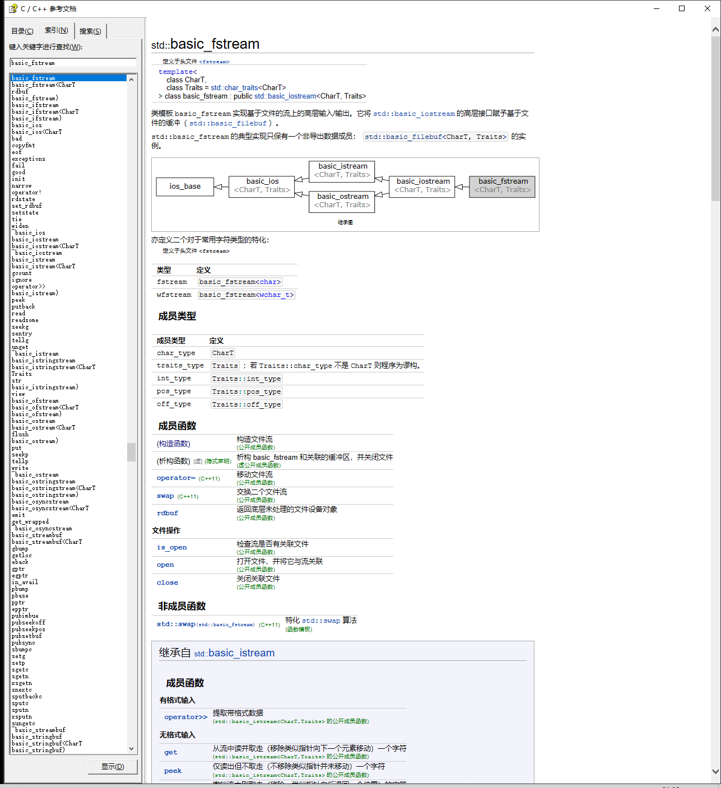

##### cppreference.com

[cppreference.com](https://zh.cppreference.com/w/首页)

##### cppreference-zh-20200314

离线文档。

前进返回：Alt+左右箭头。

##### JSON

使用键值对格式的字符串。

冒号左面是键，类型是字符串。

冒号右面是值，类型可以是字符串、整型、bool。

{}里面是结构体成员。

[]是数组成员。

程序配置文件和网络传输使用JSON。

##### JSON在线编辑器

[JSON在线编辑器—SO JSON在线](https://www.sojson.com/editor.html)

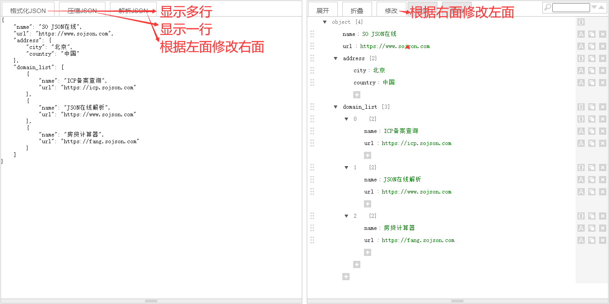

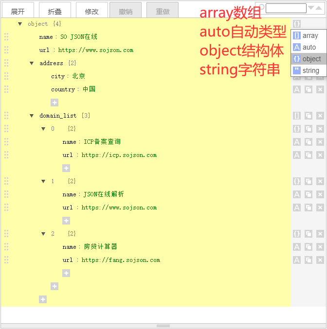

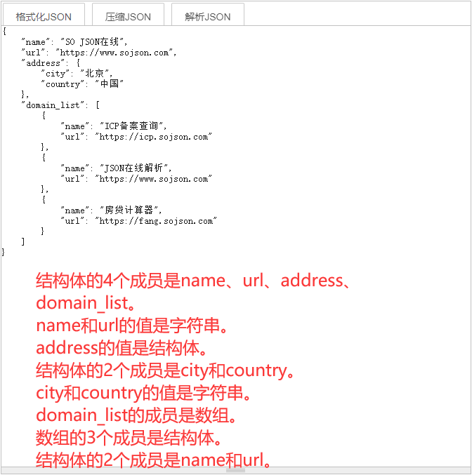

##### 键值对

冒号左面是键，

冒号右面是值，

一对键和值组成键值对。

##### CJsonObject

[Bwar/CJsonObject: Ultralightweight JSON parser in C++ based on cJSON (github.com)](https://github.com/Bwar/CJsonObject)

下载，解压，复制这四个文件到项目文件夹，


拖进项目中，包含CJsonObject.hpp头文件。

```c++
#include <iostream>
using namespace std;

#include "CJsonObject.hpp"
using namespace neb;

int main()
{
	// 使用原生字符串存储JSON
	char sz[] = R"({"name":"SO JSON在线","url":"https://www.sojson.com","address":{"city":"北京","country":"中国"},"domain_list":[{"name":"ICP备案查询","url":"https://icp.sojson.com"},{"name":"JSON在线解析","url":"https://www.sojson.com"},{"name":"房贷计算器","url":"https://fang.sojson.com"}],"整型":12345678,"浮点":3.14,"布尔":false})";

	// 定义CJsonObject类对象
	CJsonObject jsonobjectA;

	// 分析JSON
	jsonobjectA.Parse(sz);

	// 存储分析结果的变量
	string stringName;
	int n = 0;
	double d = 0.;
	bool b = true;
	string stringJson;

	// 读出
	jsonobjectA.Get("name", stringName);
	jsonobjectA.Get("整型", n);
	jsonobjectA.Get("浮点", d);
	jsonobjectA.Get("布尔", b);

	// 输出读出结果
	cout << stringName << " " << n << " " << d << " " << b << " " << endl;
	
	// 定义CJsonObject类对象
	CJsonObject jsonobjectB;

	// 写入
	jsonobjectB.Add("整型", n);
	jsonobjectB.Add("浮点", d);
	jsonobjectB.Add("布尔", b);

	// 获取JSON字符串
	stringJson = jsonobjectB.ToFormattedString();

	// 输出写入结果
	cout << stringJson << endl;

	return 0;
}
```

##### 类继承

如果子类是父类，那么两个类是继承关系，
如果类有成员类，那么两个类是组合关系，
如果两种情况都行，优先使用组合。

子类（派生类）继承父类（基类），
基类（父类）派生出派生类（子类）。
在绝大多数情况使用公有继承。

protected权限是为子类访问父类设计的。

子类使用初始化列表调用父类的构造函数。

构造函数顺序父类、成员类、子类（自己），
析构函数顺序子类（自己）、成员类、父类。

| 父类权限  | 公有继承的子类访问 | 类外访问 |
| --------- | ------------------ | -------- |
| public    | √                  | √        |
| protected | √                  | ×        |
| private   | ×                  | ×        |

```c++
#include <iostream>
using namespace std;

class CTestA // 父类CTestA
{
public:
	CTestA(int nA1, int nA2);
	~CTestA();

protected:
	int m_nA2; // 父类保护成员变量

private:
	int m_nA1;
};

CTestA::CTestA(int nA1, int nA2) :
	m_nA1(nA1),
	m_nA2(nA2)
{
	cout << "父类有参构造" << endl;
}

CTestA::~CTestA()
{
	cout << "父类析构" << endl;
	m_nA1 = 0;
	m_nA2 = 0;
}

class CTestB // 子类CTestB
	:public CTestA // CTestB公有继承CTestA
{
public:
	CTestB(int nA1, int nA2, int nB);
	~CTestB();
	void Fun();

private:
	int m_nB;
};

CTestB::CTestB(int nA1, int nA2, int nB) :
	CTestA(nA1, nA2), // 子类使用初始化列表调用父类的有参构造函数
	m_nB(nB)
{
	cout << "子类有参构造" << endl;
}

CTestB::~CTestB()
{
	cout << "子类析构" << endl;
	m_nB = 0;
}

void CTestB::Fun()
{
	// m_nA1; // 报错，error C2248: “CTestA::m_nA1”: 无法访问 private 成员(在“CTestA”类中声明)
	m_nA2; // 子类访问父类保护成员变量
}

int main()
{
	CTestB testb(11111111, 22222222, 33333333);

	return 0;
}

// 父类有参构造
// 子类有参构造
// 子类析构
// 父类析构
```

在子类对象的内存中，子类成员变量内存在父类成员变量内存后面。

private权限是编译器限制。

```c++
#include <iostream>
using namespace std;

class CTestA
{
public:
	CTestA(int nA1, int nA2);
	~CTestA();
	void Fun();

protected:
	int m_nA2;

private:
	int m_nA1; // 父类私有成员变量
};

CTestA::CTestA(int nA1, int nA2) :
	m_nA1(nA1),
	m_nA2(nA2)
{
}

CTestA::~CTestA()
{
	m_nA1 = 0;
	m_nA2 = 0;
}

void CTestA::Fun()
{
	cout << m_nA1 << endl;
}

class CTestB :public CTestA
{
public:
	CTestB(int nA1, int nA2, int nB);
	~CTestB();

private:
	int m_nB;
};

CTestB::CTestB(int nA1, int nA2, int nB) :
	CTestA(nA1, nA2),
	m_nB(nB)
{
}

CTestB::~CTestB()
{
	m_nB = 0;
}

int main()
{
	CTestB testb(11111111, 22222222, 33333333);
	*(((int*)(&testb)) + 1) = 44444444; // 取地址强转访问父类私有成员
	testb.Fun();

	return 0;
}
```

子类指针访问父类对象不安全，会访问越界。

父类指针访问子类对象安全。

```c++
#include <iostream>
using namespace std;

class CTestA
{
public:
	CTestA(int nA1, int nA2);
	~CTestA();

public:
	int m_nA1;
	int m_nA2;
};

CTestA::CTestA(int nA1, int nA2) :
	m_nA1(nA1),
	m_nA2(nA2)
{
}

CTestA::~CTestA()
{
	m_nA1 = 0;
	m_nA2 = 0;
}

class CTestB :public CTestA
{
public:
	CTestB(int nA1, int nA2, int nB);
	~CTestB();

public:
	int m_nB;
};

CTestB::CTestB(int nA1, int nA2, int nB) :
	CTestA(nA1, nA2),
	m_nB(nB) 
{
}

CTestB::~CTestB()
{
	m_nB = 0;
}

int main()
{
	CTestA testa(11111111, 22222222);
	CTestB testb(33333333, 44444444, 55555555);
	CTestA* ptesta = nullptr;
	CTestB* ptestb = nullptr;
	
	ptesta = (CTestA*)(&testb); // 安全
	ptestb = (CTestB*)(&testa); // 不安全
	// ptestb->m_nB = 66666666; // 运行异常，访问越界

	return 0;
}
```

##### 函数隐藏

如果子类和父类有同名成员函数或变量，那么只使用子类的成员函数或变量。
可以使用作用域运算符调用父类函数，访问父类变量。

先在子类作用域寻找函数名（找到，检查参数类型（不匹配，报错），调用函数），
再去父类作用域寻找函数名（找到，检查参数类型（不匹配，报错），调用函数），
再去全局作用域寻找函数名（找到，检查参数类型（不匹配，报错），调用函数），
报错。

```c++
#include <iostream>
using namespace std;

class CTestA
{
public:
	CTestA(int n);
	~CTestA();
	void Fun(); // 子类和父类的同名成员函数

protected:
	int m_n; // 子类和父类的同名成员变量
};

CTestA::CTestA(int n) :
	m_n(n)
{
}

CTestA::~CTestA()
{
	m_n = 0;
}

void CTestA::Fun()
{
	cout << "父类成员函数" << endl;
	cout << m_n << endl;
}

class CTestB :public CTestA
{
public:
	CTestB(int nA, int nB);
	~CTestB();
	void Fun(); // 子类和父类的同名成员函数

private:
	int m_n; // 子类和父类的同名成员变量
};

CTestB::CTestB(int nA, int nB) :
	CTestA(nA),
	m_n(nB)
{
}

CTestB::~CTestB()
{
	m_n = 0;
}

void CTestB::Fun()
{
	cout << "子类成员函数" << endl;
	cout << m_n << endl;         // 22222222，访问子类变量
	cout << CTestA::m_n << endl; // 11111111，使用作用域运算符访问父类变量
}

int main()
{
	CTestB testb(11111111, 22222222);
	testb.Fun(); // void CTestB::Fun();，调用子类函数

	testb.CTestA::Fun(); // void CTestA::Fun()，使用作用域运算符调用父类函数

	return 0;
}
```

##### 子类（外部类）的父类、成员类、嵌套类（内部类）


| 父类权限  | 公有继承的子类访问 |
| --------- | ------------------ |
| public    | √                  |
| protected | √                  |
| private   | ×                  |

| 成员类权限 | 有成员类的类 |
| ---------- | ------------ |
| public     | √            |
| protected  | ×            |
| private    | ×            |

| 内部类    | 外部类 |
| --------- | ------ |
| public    | √      |
| protected | ×      |
| private   | ×      |

```c++
#include <iostream>
using namespace std;

class CTestA // 父类CTestA
{
public:
	CTestA(int nA1, int nA2);
	~CTestA();

protected:
	int m_nA2; // 父类保护成员变量

private:
	int m_nA1;
};

CTestA::CTestA(int nA1, int nA2) :
	m_nA1(nA1),
	m_nA2(nA2)
{
}

CTestA::~CTestA()
{
	m_nA1 = 0;
	m_nA2 = 0;
}

class CTestB // 成员类CTestB
{
public:
	CTestB(int nB1, int nB2);
	~CTestB();

protected:
	int m_nB2; // 成员类保护成员变量

private:
	int m_nB1;
};

CTestB::CTestB(int nB1, int nB2) :
	m_nB1(nB1),
	m_nB2(nB2)
{
}

CTestB::~CTestB()
{
	m_nB1 = 0;
	m_nB2 = 0;
}

class CTestD // 子类（外部类）CTestD
	:public CTestA // CTestD公有继承CTestA
{
public:
	CTestD(int nA1, int nA2, int nB1, int nB2, int nC1, int nC2, int nD1, int nD2);
	~CTestD();
	void Fun();

	class CTestC // 内部类CTestC
	{
	public:
		CTestC(int nC1, int nC2);
		~CTestC();
		void Fun();

	protected:
		int m_nC2; // 内部类保护成员变量

	private:
		int m_nC1;
	}testc;

protected:
	int m_nD2;

private:
	CTestB testb; // 成员类
	int m_nD1;
};

CTestD::CTestD(int nA1, int nA2, int nB1, int nB2, int nC1, int nC2, int nD1, int nD2) :
	CTestA(nA1, nA2), // 父类有参构造
	testb(nB1, nB2),  // 成员类有参构造
	testc(nC1, nC2),  // 内部类有参构造
	m_nD1(nD1),		  // 成员变量
	m_nD2(nD2)		  // 成员变量
{
}

CTestD::~CTestD()
{
	m_nD1 = 0;
	m_nD2 = 0;
}

void CTestD::Fun()
{
	// m_nA1;       // 报错，父类私有
	// m_nA2;
	// testb.m_nB1; // 报错，成员类私有
	// testb.m_nB2; // 报错，成员类保护
	// testc.m_nC1; // 报错，内部类私有
	// testc.m_nC2; // 报错，内部类保护
}

CTestD::CTestC::CTestC(int nC1, int nC2) :
	m_nC1(nC1),
	m_nC2(nC2)
{
}

CTestD::CTestC::~CTestC()
{
	m_nC1 = 0;
	m_nC2 = 0;
}

void CTestD::CTestC::Fun()
{
	// m_nA1;       // 报错，没有对象
	// m_nA2;	    // 报错，没有对象
	// testb.m_nB1; // 报错，没有对象
	// testb.m_nB2; // 报错，没有对象
	// m_nD1;       // 报错，没有对象
	// m_nD2;       // 报错，没有对象
}

int main()
{
	CTestD testd(11111111, 22222222, 33333333, 44444444, 55555555, 66666666, 77777777, 88888888);

	return 0;
}
```

##### 类成员函数指针

可以类成员函数指针调用成员函数或全局函数。

定义【成员函数指针类型】。

```c++
typedef 返回值类型(调用约定 类名::* 函数指针类型名)(参数类型, 参数类型);
```

赋值【成员函数指针变量】。

```c++
成员函数指针变量 = &类名::成员函数名;
```

使用【类对象】和【成员函数指针变量】调用【成员函数】。

```c++
(类对象.*成员函数指针变量)(实参, 实参);
```

使用【类对象指针】和【成员函数指针变量】调用【成员函数】。

```c++
(类对象指针->*成员函数指针变量)(实参, 实参);
```

```c++
#include <iostream>
using namespace std;

class CTest
{
public:
	void __stdcall Fun(int nA, int nB); // 成员函数
};

void __stdcall CTest::Fun(int nA, int nB)
{
	cout << nA << " " << nB << endl;
}

typedef void(__stdcall CTest::* PFN_I_S_CTest_II)(int, int); // 定义【成员函数指针类型】

int main()
{
	CTest test;				           // 定义【类对象】
	CTest* ptest = nullptr;	           // 定义【类对象指针】
	PFN_I_S_CTest_II pfnFun = nullptr; // 定义【成员函数指针变量】

	ptest = &test;			// 赋值【类对象指针】
	pfnFun = &CTest::Fun;   // 赋值【成员函数指针变量】
	(test.*pfnFun)(11111111, 22222222);   // 使用【类对象】和【成员函数指针变量】调用【成员函数】
	(ptest->*pfnFun)(33333333, 44444444); // 使用【类对象指针】和【成员函数指针变量】调用【成员函数】

	return 0;
}
```

##### 俄罗斯方块

（Tetris）。

如何设计使得代码通用【C、C++、C++SDK、16位汇编】4个版本。

main.c文件是程序入口，调用游戏类，游戏类有地图类，地图类有方块类。

地图类成员变量【地图二维数组】。

方块类成员变量【方块位置结构体】、【方块形状（一维数组下标）】、【方块角度（二维数组下标）】。

【游戏类】调用【地图类初始化墙】，写进地图数组。

【游戏类】调用【方块类初始化方块】，随机方块位置，写进地图数组。

【游戏类】调用【地图类显示地图】。

【游戏类成员函数】循环检测按键和定时器（有按键/定时器，调用对应【地图类方向函数】）

【地图类下移函数】通过判断方块数组和地图数组是否重合判断方块是否可以下移（不可以，方块数组写入地图数组，消行，判断是否死亡（是，调用游戏失败函数），产生新方块，显示界面，返回），修改方块位置结构体，显示界面。

【地图类左右移或旋转函数】通过判断方块数组和地图数组是否重合判断方块是否可以左右移或旋转（可以，修改方块位置结构体或方块角度，显示界面）。

每次修改方块位置结构体或方块角度之前地图清方块，之后地图写方块。

从下往上循环判断是否可以消行（能，地图数组本行置空，这行上面固定方块下落）。

##### using

using关键字额外支持模板。

为类型起别名，和typedef关键字效果一样。

```c++
typedef 别名 = 原类型;
```

为函数指针类型起别名。

```c++
using 函数指针类型名 = 返回值类型(调用约定*)(参数类型, 参数类型);
```

```c++
#include <stdio.h>
#include <stdlib.h>

using PFN_I_C_II = int(__cdecl*)(int, int);

int __cdecl Max(int nA, int nB)
{
	return nA > nB ? nA : nB;
}

int main()
{
	PFN_I_C_II pfnMax = NULL;
	pfnMax = Max;

	printf("%d\r\n", pfnMax(11111111, 22222222));

	return 0;
}
```

为结构体类型和结构体指针类型起别名。

```c++
using 结构体类型别名 = struct 结构体原类型;
using 结构体指针类型别名 = struct 结构体原类型*;
```

```c++
#include <stdio.h>
#include <stdlib.h>

struct tagTest
{
	double d;
	float f;
	long long int lln;
	int n;
	short int sn;
	char c;
	char sz[5];
};

using TEST = struct tagTest;
using PTEST = struct tagTest*;

int main()
{
	TEST test =
	{
		3.1415926,
		3.14,
		0x1234567812345678,
		0x12345678,
		0x1234,
		0x12,
		"ABC"
	};
	PTEST ptest = NULL;
	ptest = &test;

	printf("%lf\r\n", test.d);
	printf("%f\r\n", test.f);
	printf("%llX\r\n", test.lln);
	printf("%X\r\n", test.n);
	printf("%X\r\n", test.sn);
	printf("%X\r\n", test.c);
	printf("%s\r\n", test.sz);

	printf("%lf\r\n", ptest->d);
	printf("%f\r\n", ptest->f);
	printf("%llX\r\n", ptest->lln);
	printf("%X\r\n", ptest->n);
	printf("%X\r\n", ptest->sn);
	printf("%X\r\n", ptest->c);
	printf("%s\r\n", ptest->sz);

	return 0;
}
```

##### 二级指针和const的bug

```c++
int main(int argc, char* argv[], char* envp[])
{
	const char* pn = nullptr;
	const char** ppn = nullptr;
	
	// ppn = argv; error C2440: “=”: 无法从“char *[]”转换为“const char **”
	pn = argv[0];
	ppn = &pn;

	return 0;
}
```

##### EasyX

[EasyX Graphics Library for C++](https://easyx.cn/)

EasyX Graphics Library 是针对 Visual C++ 的免费绘图库，支持 VC6.0 ~ VC2022，简单易用，学习成本极低，应用领域广泛。目前已有许多大学将 EasyX 应用在教学当中。

##### 类多态（虚函数）

定义类的静态成员，虚函数指针数组，数组记录类的虚函数地址。

在第一个成员变量位置定义虚表指针，【虚表指针】指向【静态成员函数指针数组】，

使用【指向子类对象的父类指针或引用】调用虚函数，执行子类的虚函数。

父类和子类的成员函数声明相同。

在父类的虚函数声明之前必须加virtual前缀，定义不能加。

在子类的虚函数声明之前可以加virtual前缀，定义不能加。

```c++
#include <iostream>
using namespace std;

class CTestA
{
public:
	virtual void Fun();
};

void CTestA::Fun()
{
	cout << "父类虚函数" << endl;
}

class CTestB :public CTestA
{
public:
	virtual void Fun();
};

void CTestB::Fun()
{
	cout << "子类虚函数" << endl;
}

int main()
{
	CTestA* ptesta = nullptr; // 定义父类对象指针
	ptesta = new CTestB;      // 使用父类对象指针申请子类对象内存，初始化类对象
	ptesta->Fun();            // 使用【指向子类对象的父类指针或引用】调用【这个类的对象的虚函数】
	delete ptesta;

	return 0;
}
```

在对象内存开头4字节存放虚表地址（虚表指针），在类的虚表中存放虚函数地址（函数指针）。

在编译时，生成某个类的虚表。

在构造函数代码运行之前，填写虚表指针。

使用【指向子类对象的父类指针或引用】调用虚函数，通过【指向子类对象的父类指针或引用】获取子类对象内存地址，在子类对象内存开头4字节获取虚表地址，在虚表获取虚函数地址，通过虚函数地址调用虚函数。

在析构函数代码运行之前，回填虚表指针。

在构造和析构函数中，虚表指针都指向当前类的虚表，调用虚函数没有多态效果。

```c++
#include <iostream>
using namespace std;

class CTestA
{
public:
	CTestA();
	~CTestA();
	virtual void Fun();
};

CTestA::CTestA()
{
	cout << "父类构造调用";
	Fun();
}

CTestA::~CTestA()
{
	cout << "父类析构调用";
	Fun();
}

void CTestA::Fun()
{
	cout << "父类虚函数" << endl;
}

class CTestB :public CTestA
{
public:
	CTestB();
	~CTestB();
	virtual void Fun();
};

CTestB::CTestB()
{
	cout << "子类构造调用";
	Fun();
}

CTestB::~CTestB()
{
	cout << "子类析构调用";
	Fun();
}

void CTestB::Fun()
{
	cout << "子类虚函数" << endl;
}

int main()
{
	CTestB testb;

	return 0;
}
```

直接定义子类对象，
在构造时，先调用父类构造，再调用子类构造，
在析构时，先调用子类析构，再调用父类析构。

定义父类对象指针，使用父类对象指针申请子类对象内存，初始化类对象，
在构造时，先调用父类构造，再调用子类构造，
**在析构时（使用delete关键字），只调用父类析构**。

为了解决问题，设置析构函数是虚函数，在使用delete关键字调用析构时，先调用子类析构，再调用父类析构。

```c++
#include <iostream>
using namespace std;

// #define VIRTUAL // 测试析构函数加不加virtual的情况

class CTestA
{
public:
	CTestA();
#ifdef VIRTUAL
	virtual
#endif // VIRTUAL
		~CTestA();
};

CTestA::CTestA()
{
	cout << "父类构造" << endl;
}

CTestA::~CTestA()
{
	cout << "父类析构" << endl;
}

class CTestB :public CTestA
{
public:
	CTestB();
#ifdef VIRTUAL
	virtual
#endif // VIRTUAL
		~CTestB();
};

CTestB::CTestB()
{
	cout << "子类构造" << endl;
}

CTestB::~CTestB()
{
	cout << "子类析构" << endl;
}

int main()
{
	CTestA* ptesta = nullptr; 
	ptesta = new CTestB;      
	delete ptesta;

	return 0;
}

// 在析构函数不是虚函数时
// 父类构造
// 子类构造
// 父类析构

// 在析构函数是虚函数时
// 父类构造
// 子类构造
// 子类析构
// 父类析构
```

##### override

表示这个函数重写了父类的虚函数。

```c++
#include <iostream>
using namespace std;

class CTestA
{
public:
	virtual void Fun();
};

void CTestA::Fun()
{
	cout << "父类虚函数" << endl;
}

class CTestB :public CTestA
{
public:
	virtual void Fun() override; // 这个函数重写了父类的虚函数。
};

void CTestB::Fun()
{
	cout << "子类虚函数" << endl;
}

int main()
{
	CTestA* ptesta = nullptr;
	ptesta = new CTestB;
	ptesta->Fun();
	delete ptesta;

	return 0;
}
```

##### 默认构造和析构和虚函数

```c++
if (类没有任何一个构造函数 && 
    (有虚函数 || 在成员变量定义处直接初始化 || 父类有默认构造 || 成员类有默认构造))
{
	编译器提供一个默认构造;
}
```

```c++
#include <iostream>
using namespace std;

#define TEST 0

class CTestA
{
#if TEST 3
public:
	CTestA() {}
#endif // TEST 3

private:
	int m_nA;
};

class CTestB
{
#if TEST 4
public:
	CTestB() {}
#endif // TEST 4

private:
	int m_nB;
};

class CTestC :public CTestA
{
#if TEST 1
public:
	virtual void Fun() {}
#endif // TEST 1

private:
	CTestB testb;
#if TEST 2
	int m_nC = 12345678;
#endif // TEST 2
};

int main()
{
	CTestC testc;

	return 0;
}
```

```c++
if (类没有任何一个析构函数 && 
    (有虚函数 || 在成员变量定义处直接初始化 || 父类有默认析构 || 成员类有默认析构))
{
	编译器提供一个默认析构;
}
```

##### 抽象类和纯虚函数

在虚函数声明之后加后缀= 0后缀是纯虚函数。

有纯虚函数的类是抽象类，不能实例化对象。

如果抽象类的子类没有实现纯虚函数，那么子类也是抽象类。

```c++
#include <iostream>
using namespace std;

class CTestA // 抽象类
{
public:
	virtual void Fun() = 0; // 纯虚函数
};

void CTestA::Fun()
{
	cout << "父类虚函数" << endl;
}

class CTestB :public CTestA
{
public:
	virtual void Fun() override;
};

void CTestB::Fun()
{
	cout << "子类虚函数" << endl;
}

int main()
{
	// CTestA testa; // 报错，error C2259: “CTestA”: 无法实例化抽象类
	CTestA* ptesta = nullptr;
	ptesta = new CTestB;
	ptesta->Fun();
	delete ptesta;

	return 0;
}
```

##### 多重继承

一个子类有多个父类，先继承的父类先构造，后析构，成员变量在前面。

父子类指针互相转换赋值，不是直接赋值，而是修正后赋值。

访问两个父类都有的成员变量会产生二义性。

```c++
#include <iostream>
using namespace std;

class CTestA
{
protected:
	int m_n;
};

class CTestB
{
protected:
	int m_n;
};

class CTestC :public CTestA, public CTestB
{
public:
	CTestC();

private:
	int m_n;
};

CTestC::CTestC()
{
	m_n = 0x11111111;
	CTestA::m_n = 0x11111111; // 使用作用域运算符，指定访问类
	CTestB::m_n = 0x22222222; // 使用作用域运算符，指定访问类
	CTestC::m_n = 0x33333333; // 使用作用域运算符，指定访问类
}

int main()
{
	return 0;
}
```

##### 菱形继承

 一个子类有多个父类，这些父类有共同的父类（爷爷类），爷爷类的成员变量在内存有多份。

```c++
#include <iostream>
using namespace std;

class CTestA // 爷爷类
{
protected:
	int m_nA = 0x11111111;
};

class CTestB :public CTestA // 父类
{
protected:
	int m_nB = 0x22222222;
};

class CTestC :public CTestA // 父类
{
private:
	int m_nC = 0x33333333;
};

class CTestD :public CTestB, public CTestC // 子类
{
private:
	int m_nD = 0x44444444;
};

int main()
{
	CTestD testd;

	return 0;
}
```

##### 虚继承

解决了【菱形继承的爷爷类的成员变量】在内存有多份的问题。

在父类之前加virtual前缀。

爷爷类是虚基类。

```c++
#include <iostream>
using namespace std;

class CTestA
{
protected:
	int m_nA = 0x11111111;
};

class CTestB :virtual public CTestA // 虚继承
{
protected:
	int m_nB = 0x22222222;
};

class CTestC :virtual public CTestA // 虚继承
{
private:
	int m_nC = 0x33333333;
};

class CTestD :public CTestB, public CTestC
{
private:
	int m_nD = 0x44444444;
};

int main()
{
	CTestD testd;

	return 0;
}
```

##### 函数重载覆盖隐藏

|          | virtual | 调用约定 | 返回值类型 | 作用域 | 函数名 | 参数列表 |
| -------- | ------- | -------- | ---------- | ------ | ------ | -------- |
| 函数重载 |         |          |            | 相同   | 相同   | 不同     |
| 函数覆盖 | 是      | 相同     | 相同       | 父子   | 相同   | 相同     |
| 函数隐藏 | 不是    |          |            | 父子   | 相同   |          |

##### 类对象内存结构

###### 单个类

类成员变量

###### 单继承

父类成员变量

子类成员变量

###### 多重继承

先继承的 父类的 成员变量

后继承的 父类的 成员变量

​                 子类的 成员变量

###### 菱形继承

子类先继承的 父类继承的 爷爷类的 成员变量

子类先继承的                         父类的 成员变量

子类后继承的 父类继承的 爷爷类的 成员变量

子类后继承的                         父类的 成员变量

​                                                子类的 成员变量

```c++
class CTestA
{
protected:
	int m_nA = 0x11111111;
};

class CTestB :public CTestA
{
protected:
	int m_nB = 0x22222222;
};

class CTestC :public CTestA
{
protected:
	int m_nC = 0x33333333;
};

class CTestD :public CTestB, public CTestC
{
protected:
	int m_nD = 0x44444444;
};

int main()
{
	CTestD testd;

	return 0;
}

// 0x0019FECC 11111111 子类先继承的父类继承的爷爷类的成员变量
// 0x0019FED0 22222222 子类先继承的父类的成员变量
// 0x0019FED4 11111111 子类后继承的父类继承的爷爷类的成员变量
// 0x0019FED8 33333333 子类后继承的父类的成员变量
// 0x0019FEDC 44444444 子类的成员变量
```

###### 单个类，有虛函数

虚表指针

类成员变量

###### 单继承，有虚函数

虚表指针

父类成员变量

子类成员变量

###### 多重继承，有虚函数

​    有虚函数的 先继承的 父类的 虚表指针（这个虚表也有子类增加的虚函数地址）

​    有虚函数的 先继承的 父类的 成员变量

​    有虚函数的 后继承的 父类的 虚表指针

​    有虚函数的 后继承的 父类的 成员变量

没有虚函数的 先继承的 父类的 成员变量

没有虚函数的 后继承的 父类的 成员变量

​                                         子类的 成员变量

之后默认有虚函数的父类排在前面，先继承的父类在其他条件相同时排在前面。

```c++
class CTestA
{
protected:
	int m_nA = 0x11111111;
};

class CTestB
{
protected:
	int m_nB = 0x22222222;
};

class CTestC
{
protected:
	virtual void FunC() {}
	int m_nC = 0x33333333;
};

class CTestD
{
protected:
	virtual void FunD() {}
	int m_nD = 0x44444444;
};

class CTestE :public CTestA, public CTestB, public CTestC, public CTestD
{
protected:
	virtual void FunE() {}
	int m_nE = 0x55555555;
};

int main()
{
	CTestE teste;

	return 0;
}

// 0x0019FEC4 00417b4c 有虚函数的先继承的父类的虚表指针
// 0x0019FEC8 33333333 有虚函数的先继承的父类的成员变量
// 0x0019FECC 00417b5c 有虚函数的后继承的父类的虚表指针
// 0x0019FED0 44444444 有虚函数的后继承的父类的成员变量
// 0x0019FED4 11111111 没有虚函数的先继承的父类的成员变量
// 0x0019FED8 22222222 没有虚函数的后继承的父类的成员变量
// 0x0019FEDC 55555555 子类的成员变量
```

###### 菱形继承，有虚函数

子类先继承的                         父类的 虚表指针（这个虚表也有子类增加的虚函数地址）

子类先继承的 父类继承的 爷爷类的 成员变量

子类先继承的                         父类的 成员变量

子类后继承的                         父类的 虚表指针

子类后继承的 父类继承的 爷爷类的 成员变量

子类后继承的                         父类的 成员变量

​                                                子类的 成员变量

```c++
class CTestA
{
protected:
	virtual void FunA() {}
	int m_nA = 0x11111111;
};

class CTestB :public CTestA
{
protected:
	virtual void FunB() {}
	int m_nB = 0x22222222;
};

class CTestC :public CTestA
{
protected:
	virtual void FunC() {}
	int m_nC = 0x33333333;
};

class CTestD :public CTestB, public CTestC
{
protected:
	virtual void FunD() {}
	int m_nD = 0x44444444;
};

int main()
{
	CTestD testd;

	return 0;
}

// 0x0019FEC4 00417b58 子类先继承的父类的虚表指针
// 0x0019FEC8 11111111 子类先继承的父类继承的爷爷类的成员变量
// 0x0019FECC 22222222 子类先继承的父类的成员变量
// 0x0019FED0 00417c10 子类后继承的父类的虚表指针
// 0x0019FED4 11111111 子类后继承的父类继承的爷爷类的成员变量
// 0x0019FED8 33333333 子类后继承的父类的成员变量
// 0x0019FEDC 44444444 子类的成员变量
```

###### 单虚继承，有虚函数

子类                   虚表指针（这个虚表只有子类增加的虚函数地址）

子类                   偏移块指针

子类                   成员变量

父类（虚基类）虚表指针

父类（虚基类）成员变量

```c++
class CTestA
{
protected:
	virtual void FunA() {}
	int m_nA = 0x11111111;
};

class CTestB :virtual public CTestA
{
protected:
	virtual void FunB() {}
	int m_nB = 0x22222222;
};

int main()
{
	CTestB testb;

	return 0;
}
 
// 0x0019FECC 00417b40 子类虚表指针（这个虚表只有子类增加的虚函数地址）
// 0x0019FED0 00417b54 子类偏移块指针
// 0x0019FED4 22222222 子类成员变量
// 0x0019FED8 00417b4c 父类（虚基类）虚表指针
// 0x0019FEDC 11111111 父类（虚基类）成员变量
```

###### 菱形虚继承，有虚函数

先继承的 父类的    虚表指针（这个虚表也有子类增加的虚函数地址）

先继承的 父类的    偏移块指针

先继承的 父类的    成员变量

后继承的 父类的    虚表指针

后继承的 父类的    偏移块指针

后继承的 父类的    成员变量

子类的                    成员变量

爷爷类（虚基类） 的虚表指针

爷爷类（虚基类） 的成员变量

```c++
class CTestA
{
protected:
	virtual void FunA() {}
	int m_nA = 0x11111111;
};

class CTestB :virtual public CTestA
{
protected:
	virtual void FunB() {}
	int m_nB = 0x22222222;
};

class CTestC :virtual public CTestA
{
protected:
	virtual void FunC() {}
	int m_nC = 0x33333333;
};

class CTestD :public CTestB, public CTestC
{
protected:
	virtual void FunD() {}
	int m_nC = 0x44444444;
};

int main()
{
	CTestD testd;

	return 0;
}

// 0x0019FEBC 00417b88 先继承的父类的虚表指针
// 0x0019FEC0 00417ba8 先继承的父类的偏移块指针
// 0x0019FEC4 22222222 先继承的父类的成员变量
// 0x0019FEC8 00417b94 后继承的父类的虚表指针
// 0x0019FECC 00417bb4 后继承的父类的偏移块指针
// 0x0019FED0 33333333 后继承的父类的成员变量
// 0x0019FED4 44444444 子类的成员变量
// 0x0019FED8 00417ba0 爷爷类（虚基类）的虚表指针
// 0x0019FEDC 11111111 爷爷类（虚基类）的成员变量
```

###### 偏移块

从偏移块指针地址到这个类虚表指针的偏移

从偏移块指针地址到虚基类的偏移

##### 运算符重载

[运算符重载 - cppreference.com](https://zh.cppreference.com/w/cpp/language/operators)

使用运算符重载让运算符支持自定义类型（类类型）。

不要改变运算符原有的意义和用法。

```c++
返回值类型 operator要重载的运算符(参数类型 参数名)
{
	函数体;
}
```

=运算符重载，传入类的引用（类对象的this指针可以看作引用），返回类的引用（*this），可以连续调用成员函数，修改对象的值。

如果没有写=运算符重载，那么编译器提供一个默认的=运算符重载，参数是类对象引用。

=运算符重载和拷贝构造容易混淆。

+运算符重载，传入类的引用（类对象的this指针可以看作引用），返回临时类对象，可以连续调用成员函数，不修改对象的值。

使用友元函数支持整型+类对象的+运算符重载。

不能区分前++和后++，语法强行规定后++有个int类型参数。

前++返回类的引用（*this），后++返回临时类对象。

<<运算符重载，传入ostream类引用，返回ostream类引用。

()转换运算符，自定义转换运算符的实现。

```c++
#include <iostream>
using namespace std;

class CTest
{
public:
	CTest();
	CTest(int n);
	int Get();

	// =，传入类的引用，返回类的引用，可以连续调用成员函数，修改对象的值
	CTest& operator=(const CTest& obj);                             
	CTest& operator=(int n);                                        
	// +，传入类的引用，返回临时类对象，可以连续调用成员函数，不修改对象的值
	CTest operator+(const CTest& obj);                              
	CTest operator+(int n);                                         // +
	friend CTest operator+(int n, const CTest& obj);                // +，友元函数声明
	CTest& operator++();							                // 前++
	CTest operator++(int);							                // 后++
	bool operator==(int n);							                // ==
	friend bool operator==(int n, const CTest& obj);                // ==，友元函数声明
	bool operator!=(int n);							                // !=
	friend bool operator!=(int n, const CTest& obj);                // !=，友元函数声明
	friend ostream& operator<<(ostream& ostream, const CTest& obj); // <<，友元函数声明
	operator int();								                    // ()

private:
	int m_n;
};

CTest::CTest()
{
	m_n = 0;
}

CTest::CTest(int n)
{
	m_n = n;
}

int CTest::Get()
{
	return m_n;
}

CTest& CTest::operator=(const CTest& obj)
{
	m_n = obj.m_n;
	return *this;
}

CTest& CTest::operator=(int n)
{
	m_n = n;
	return *this;
}

CTest CTest::operator+(const CTest& obj)
{
	return CTest(m_n + obj.m_n);
}

CTest CTest::operator+(int n)
{
	return CTest(m_n + n);
}

CTest operator+(int n, const CTest& obj) // 使用友元函数支持整型+类对象
{
	return CTest(n + obj.m_n);
}

CTest& CTest::operator++()
{
	m_n++;
	return *this;
}

CTest CTest::operator++(int)
{
	CTest test(m_n);
	m_n++;
	return test;
}

bool CTest::operator==(int n)
{
	return (m_n == n);
}

bool operator==(int n, const CTest& obj)
{
	return (obj.m_n == n);
}

bool CTest::operator!=(int n)
{
	return !(*this == n);
}

bool operator!=(int n, const CTest& obj)
{
	return !(obj.m_n == n);
}

ostream& operator<<(ostream& ostream, const CTest& obj)
{
	return ostream << obj.m_n;
}

CTest::operator int()
{
	return m_n;
}

int main()
{
	CTest testA;
	CTest testB = testA;   // 拷贝构造
	testA = 11111111;      // =
	testB = testA;	       // =
	testA + testB;         // +
	testA + 33333333;      // +
	44444444 + testA;      // +
	testA++;			   // 前++
	++testA;			   // 后++
	testA == 55555555;	   // ==
	66666666 == testA;	   // ==
	cout << testA << endl; // <<
	int n = testA;		   // ()

	return 0;
}
```

[]运算符重载，传入整型下标，返回数组元素引用。

new运算符重载之后，也会调用构造，

delete运算符重载之后，也会调用析构。

new、delete和new[]、delete[]不是相同的运算符。

私有new和delete运算符。

```c++
#include <iostream>
using namespace std;

class CBuffer
{
public:
	CBuffer();
	CBuffer(const CBuffer& obj);
	~CBuffer();
	void Set(const char* pBuff, int nSize);
	char* GetBuffer()const;
	int GetSize()const;
	char& operator[](int n);           // []运算符
	void* operator new(size_t size);   // new运算符
	void operator delete(void* p);     // delete运算符
	void* operator new[](size_t size); // new运算符
	void operator delete[](void* p);   // delete运算符

private:
	void SetZero();
	void Clear();
	void DecRefCnt();

private:
	char* m_pcBuffer;
	int m_nSize;
	int* m_pnRefCnt;
};

CBuffer::CBuffer()
{
	SetZero();
}

CBuffer::CBuffer(const CBuffer& obj)
{
	if (obj.m_pcBuffer == nullptr || obj.m_pnRefCnt == nullptr)
	{
		SetZero();
		return;
	}

	m_pcBuffer = obj.m_pcBuffer;
	m_nSize = obj.m_nSize;
	m_pnRefCnt = obj.m_pnRefCnt;
	*(obj.m_pnRefCnt) = *(obj.m_pnRefCnt) + 1;
}

CBuffer::~CBuffer()
{
	DecRefCnt();
}

void CBuffer::Set(const char* pBuff, int nSize)
{
	DecRefCnt();

	if (pBuff == nullptr)
	{
		SetZero();
		return;
	}

	m_pcBuffer = new char[nSize];
	if (m_pcBuffer == nullptr)
	{
		SetZero();
		return;
	}
	memcpy(m_pcBuffer, pBuff, nSize);
	m_pnRefCnt = new int(1);
	m_nSize = nSize;
}

char* CBuffer::GetBuffer() const
{
	return m_pcBuffer;
}

int CBuffer::GetSize() const
{
	return m_nSize;
}

void CBuffer::SetZero()
{
	m_pcBuffer = nullptr;
	m_nSize = 0;
	m_pnRefCnt = nullptr;
}

void CBuffer::Clear()
{
	if (m_pcBuffer != nullptr)
	{
		delete[] m_pcBuffer;
	}
	if (m_pnRefCnt != nullptr)
	{
		delete m_pnRefCnt;
	}
	SetZero();
}

void CBuffer::DecRefCnt()
{
	if (m_pcBuffer == nullptr || m_pnRefCnt == nullptr)
	{
		return;
	}

	*m_pnRefCnt = *m_pnRefCnt - 1;
	if (*m_pnRefCnt == 0)
	{
		Clear();
	}
}

char& CBuffer::operator[](int n) // []运算符
{
	return m_pcBuffer[n];
}

void* CBuffer::operator new(size_t size) // new运算符
{
	return malloc(size);
}

void CBuffer::operator delete(void* p) // delete运算符
{
	free(p);
}

void* CBuffer::operator new[](size_t size) // new[]运算符
{
	return malloc(size);
}

void CBuffer::operator delete[](void* p) // delete[]运算符
{
	free(p);
}

int main()
{
	CBuffer* pbuffer = nullptr;
	pbuffer = new CBuffer; // new运算符

	pbuffer->Set("ABC", 4);
	(*pbuffer)[0] = 'a';
	cout << pbuffer->GetBuffer() << endl;
	
	delete pbuffer; // delete运算符

	pbuffer = new CBuffer[2]; // new[]运算符
	delete[] pbuffer; // delete[]运算符

	return 0;
}
```

实现仿函数和闭包。

```c++
class CAdd
{
public:
	int operator()(int n1, int n2)
	{
		return n1 + n2;
	}
};

int main()
{
	CAdd add;
	int nRet = add(1, 2);
	return 0;
}
```

##### stringstream

格式化字符串。

```c++
#include <sstream>
using namespace std;
stringstream stringstreamA;
stringstreamA << 12345678 << 3.14 << "Hello world!" << endl;
```

##### 模板（泛型）

使用一套函数模板生成多种参数类型函数。

###### 函数模板

隐式（没有指定使用的类型）实例化，编译器为每个类型调用函数生成对应函数实现。

```c++
#include <iostream>
using namespace std;

template<typename T> // T是类型名
T Add(T tA, T tB)
{
	return tA + tB;
}

int main()
{
	cout << Add(11111111, 22222222) << endl; // int Add(int tA, int tB)
	cout << Add(3.14, 2.72) << endl;         // double Add(double tA, double tB)

	return 0;
}
```

两个实参推测出不同类型，无法选择，报错。

```c++
#include <iostream>
using namespace std;

template<typename T>
T Add(T tA, T tB)
{
	return tA + tB;
}

int main()
{
	// cout << Add(12345678, 3.14) << endl; // 报错，error C2672: “Add”: 未找到匹配的重载函数

	return 0;
}
```

可以重载。

```c++
#include <iostream>
using namespace std;

template<typename T> // T是类型名，模板重载
T Add(T tA, T tB)
{
	return tA + tB;
}

template<typename TA, typename TB> // TA和TB是类型名，模板重载
TA Add(TA ta, TB tb)
{
	return ta + tb;
}

int main()
{
	cout << Add(11111111, 22222222) << endl; // T Add(T tA, T tB)
	cout << Add(3.14, 2.72) << endl;         // T Add(T tA, T tB)
	cout << Add(33333333, 3.14) << endl;     // TA Add(TA ta, TB tb)
	cout << Add(3.14, 44444444) << endl;     // TA Add(TA ta, TB tb)

	return 0;
}
```

显式（指定使用的类型）实例化，可以指定所有参数类型，也可以指定某几个参数类型。

```c++
#include <iostream>
using namespace std;

template<typename TA, typename TB>
TA Add(TA tA, TB tB)
{
	return tA + tB;
}

int main()
{
	cout << Add<int, double>(11111111, 3.14) << endl; // 指定所有参数类型
	cout << Add<int>(22222222, 3.14) << endl;         // 指定一个参数类型

	return 0;
}
```

模板参数可以有默认类型，在模板实例化时，匹配优先级：指定类型＞推测类型＞默认类型。

```c++
#include <iostream>
using namespace std;

template<typename TA = int, typename TB = int> // 默认int类型
TA Add(TA tA, TB tB)
{
	return tA + tB;
}

int main()
{
	cout << Add<float, float>(3.14, 2.72) << endl; // float float，指定float类型
	cout << Add(3.14, 2.72) << endl;               // double double，推测出double类型，默认的int类型不起效

	return 0;
}
```

模板参数可以使用常量。

```c++
#include <iostream>
using namespace std;

template<typename T, int n> // 常量n
T Add(T tA, T tB)
{
	return tA + tB * n;
}

int main()
{
	cout << Add<int, sizeof(int)>(0x400000, 2) << endl;

	return 0;
}
```

类重载运算符，兼容基本数据类型的写法。

```c++
class CTest
{
public:
	CTest(int n);
	CTest operator+(const CTest& obj); // 重载+运算符

private:
	int m_n;
};

CTest::CTest(int n) :
	m_n(n)
{
}

CTest CTest::operator+(const CTest& obj)
{
	return CTest(m_n + obj.m_n); // 类重载了重载+运算符，兼容基本数据类型的写法
}

template<typename T>
T Add(T tA, T tB)
{
	return tA + tB;
}

int main()
{
	auto test = Add(CTest(11111111), CTest(22222222));

	return 0;
}
```

模板特例（全特化），单独为一种参数类型写函数实现。

```c++
#include <iostream>
using namespace std;

template<typename T> // 模板
T Add(T tA, T tB)
{
	return tA + tB;
}

template<> // 模板特例
const char* Add(const char* pcA, const char* pcB)
{
	// 为了演示方便没有使用安全写法
	char* pcC = new char[strlen(pcA) + strlen(pcB) + 1];
	strcpy(pcC, pcA);
	strcat(pcC, pcB);
	return pcC;
}

int main()
{
	const char* pc = nullptr;
	pc = Add("Hello ", "world!"); // 调用模板特例
	cout << pc << endl;

	return 0;
}
```

匹配优先级：普通函数＞模板特化＞模板。

```c++
#include <iostream>
using namespace std;

template<typename T> // 模板优先级最低
T Add(T tA, T tB)
{
	cout << "T Add(T tA, T tB)" << endl;
	return tA + tB;
}

template<> // 模板特化优先级中等
int Add(int tA, int tB)
{
	cout << "int Add(int tA, int tB)" << endl;
	return tA + tB;
}

int Add(int nA, int nB) // 普通函数优先级最高
{
	cout << "int Add(int nA, int nB)" << endl;
	return nA + nB;
}

int main()
{
	cout << Add(11111111, 22222222) << endl;

	return 0;
}
```

在头文件声明并定义模板。

在源文件使用模板。

**（备忘）所有必须写在头文件的函数定义都是因为需要在编译期找到这个函数定义。**

```c++
#pragma once
template<typename T>
T Add(T tA, T tB)
{
	return tA + tB;
}
```

```c++
#include <iostream>
using namespace std;

#include "Test.h"

int main()
{
	cout << Add(11111111, 22222222) << endl;
	cout << Add(3.14, 2.72) << endl;

	return 0;
}
```

######  变参函数模板

```c++
#include <iostream>
using namespace std;

template<typename... TS> // ... TS表示TS是变参类型
void Fun(TS... ts)
{
	// 使用sizeof...()获取模板参数个数
	cout << sizeof...(ts) << endl;
}

int main()
{
	Fun<int>(11111111);
	Fun<int, double>(22222222, 3.14);
	Fun<int, double, string>(33333333, 3.14, "Hello world!");

	return 0;
}

// 1
// 2
// 3
```

使用递归展开变参模板。

main函数调用Fun函数，Fun函数调用void Print(T t, TS... ts)函数，void Print(T t, TS... ts)函数递归调用自己，最后一次调用void Print(T t)函数。

[可变参数模板 - 知乎 (zhihu.com)](https://zhuanlan.zhihu.com/p/56242617)

```c++
#include <iostream>
using namespace std;

// 递归前进段最后一层
template<typename T>
void Print(T t)
{
	cout << "void Print(T t)" << endl;
	cout << typeid(t).name() << " t = " << t << endl; // 使用typeid获取变量类型
}

// 递归前进段
template<typename T, typename... TS>
void Print(T t, TS... ts)
{
	cout << "void Print(T t, TS... ts)" << endl;
	cout << typeid(t).name() << " t = " << t << endl; // 使用typeid获取变量类型
	Print(ts...);
}

template<typename... TS>
void Fun(TS... ts)
{
	cout << "void Fun(TS... ts)" << endl;
	Print(ts...);
}

int main()
{
	Fun<int>(11111111);
	Fun<int, double>(22222222, 3.14);
	Fun<int, double, string>(33333333, 3.14, "Hello world!");

	return 0;
}

// void Fun(TS... ts)
// void Print(T t)
// int t = 11111111

// void Fun(TS... ts)
// void Print(T t, TS... ts)
// int t = 22222222
// void Print(T t)
// double t = 3.14

// void Fun(TS... ts)
// void Print(T t, TS... ts)
// int t = 33333333
// void Print(T t, TS... ts)
// double t = 3.14
// void Print(T t)
// class std::basic_string<char, struct std::char_traits<char>, class std::allocator<char> > t = Hello world!
```

使用数组展开变参模板。

```c++
#include <iostream>
using namespace std;

template<typename T>
void Print(T t)
{
	cout << "void Print(T t)" << endl;
	cout << typeid(t).name() << " t = " << t << endl; // 使用typeid获取变量类型
}

template<typename... TS>
void Fun(TS... ts)
{
	cout << "void Fun(TS... ts)" << endl;
	int ary[] = { (Print(ts), 0)... }; // 逗号运算符，执行之前的代码，使用最后一个0给数组赋值
}

int main()
{
	Fun<int>(11111111);
	Fun<int, double>(22222222, 3.14);
	Fun<int, double, string>(33333333, 3.14, "Hello world!");

	return 0;
}

// void Fun(TS... ts)
// void Print(T t)
// int t = 11111111

// void Fun(TS... ts)
// void Print(T t)
// int t = 22222222
// void Print(T t)
// double t = 3.14

// void Fun(TS... ts)
// void Print(T t)
// int t = 33333333
// void Print(T t)
// double t = 3.14
// void Print(T t)
// class std::basic_string<char, struct std::char_traits<char>, class std::allocator<char> > t = Hello world!
```

###### 类成员函数模板

```c++
#include <iostream>
using namespace std;

class CTest
{
public:
	template<typename TA, typename TB> // 声明成员函数模板
	void Print(TA ta, TB tb);
};

template<typename TA, typename TB> // 定义成员函数模板
void CTest::Print(TA ta, TB tb)
{
	cout << ta << " " << tb << endl;
}

int main()
{
	CTest test;
	test.Print(11111111, 3.14);              // 隐式实例化成员函数模板
	test.Print<int>(22222222, 3.14);         // 显式实例化成员函数模板
	test.Print<int, double>(33333333, 3.14); // 显式实例化成员函数模板

	return 0;
}
```

###### 类变参成员函数模板

使用变参成员函数模板正确调用重载函数。

```c++
#include <iostream>
using namespace std;

class CTest
{
public:
	void Fun(int);
	void Fun(double);
	void Fun(const char*);

	template<typename... TS> // 声明变参成员函数模板
	void CallFun(TS... ts);
};

void CTest::Fun(int)
{
	cout << "void Fun(int)" << endl;
}

void CTest::Fun(double)
{
	cout << "void Fun(double)" << endl;
}

void CTest::Fun(const char*)
{
	cout << "void Fun(const char*)" << endl;
}

template<typename ...TS> // 定义变参成员函数模板
void CTest::CallFun(TS ...ts)
{
	int ary[] = { (Fun(ts), 0)... };
}

int main()
{
	CTest test;
	test.CallFun(11111111, 3.14, "Hello world!"); // 隐式实例化变参成员函数模板

	return 0;
}

// void Fun(int)
// void Fun(double)
// void Fun(const char*)
```

###### 类模板

必须显式实例化。

```c++
#include <iostream>
using namespace std;

template<typename T> // 类模板
class CTest
{
public:
	CTest(T t);      // 声明成员函数
	void Print(T t); // 声明成员函数

private:
	T m_t; // 成员变量
};

template<typename T> // 定义成员函数
CTest<T>::CTest(T t)
{
	m_t = t;
}

template<typename T> // 定义成员函数
void CTest<T>::Print(T t)
{
	cout << t << endl;
	cout << m_t << endl;
}

int main()
{
	// CTest testA(11111111); // 报错，error C2955: “CTest”: 使用 类 模板 需要 模板 参数列表

	CTest<int> testB(22222222);      // 显式实例化类模板
	testB.Print(33333333);           // 调用成员函数

	CTest<const char*> testC("ABC"); // 显式实例化类模板
	testC.Print("DEF");		     	 // 调用成员函数

	return 0;
}
```

类模板的成员函数模板特例（全特化）。

```c++
#include <iostream>
using namespace std;

template<typename T> // 类模板
class CTest
{
public:
	CTest(T t);
	void Print(T t); // 声明类模板成员函数

private:
	T m_t; // 成员变量
};

template<typename T> // 定义类模板成员函数
CTest<T>::CTest(T t)
{
	m_t = t;
}

template<typename T> // 定义类模板成员函数
void CTest<T>::Print(T t)
{
	cout << t << endl;
	cout << m_t << endl;
}

template<> // 定义类模板成员函数特例
void CTest<const char*>::Print(const char* t)
{
	cout << t << endl;
	cout << m_t << endl;
}

int main()
{
	CTest<const char*> test("ABC");
	test.Print("DEF"); // 调用类模板成员函数特例

	return 0;
}
```

类模板特例（全特化）。

```c++
#include <iostream>
using namespace std;

template<typename T> // 类模板
class CTest
{
public:
	CTest(T t);
	void Print(T t);

private:
	T m_t;
};

template<typename T>
CTest<T>::CTest(T t)
{
	m_t = t;
}

template<typename T>
void CTest<T>::Print(T t)
{
	cout << t << endl;
	cout << m_t << endl;
}

template<> // 类模板特例
class CTest<int>
{
public:
	CTest(int t);
	void Print(int t);

private:
	int m_t;
};

CTest<int>::CTest(int t)
{
	m_t = t;
}

void CTest<int>::Print(int t)
{
	cout << t << endl;
	cout << m_t << endl;
}

int main()
{
	CTest<int> test(12345678); // 调用类模板特例

	return 0;
}
```

子类模板继承父类模板。

```c++
#include <iostream>
using namespace std;

template<typename T> // 父类模板
class CTestA
{
public:
	CTestA(T t);
	void Print(T t);

private:
	T m_t;
};

template<typename T>
CTestA<T>::CTestA(T t)
{
	m_t = t;
}

template<typename T>
void CTestA<T>::Print(T t)
{
	cout << t << endl;
	cout << m_t << endl;
}

template<typename T> // 子类模板
class CTestB :public CTestA<T> // 子类模板继承父类模板
{
public:
	CTestB(T t);
};

template<typename T>
CTestB<T>::CTestB(T t) :
	CTestA<T>(t)
{
}

int main()
{
	CTestB<int> testb(11111111);
	testb.Print(22222222);

	return 0;
}
```

 子类继承父类模板特化。

```c++
#include <iostream>
using namespace std;

template<typename T> // 父类模板
class CTestA
{
public:
	CTestA(T t);
	void Print(T t);

private:
	T m_t;
};

template<typename T>
CTestA<T>::CTestA(T t)
{
	m_t = t;
}

template<typename T>
void CTestA<T>::Print(T t)
{
	cout << t << endl;
	cout << m_t << endl;
}

class CTestB :public CTestA<int> // 子类继承父类模板特化
{
public:
	CTestB(int t);
};

CTestB::CTestB(int t) :
	CTestA(t)
{
}

int main()
{
	CTestB testb(11111111);
	testb.Print(22222222);

	return 0;
}
```

嵌套类的外部类是模板，内部类也是模板。

```c++
#include <iostream>
using namespace std;

template<typename T> // 外部类模板
class CTestA
{
public:
	CTestA(T t);
	void PrintA(T t);
	class CTestB // 内部类
	{
	public:
		CTestB(T t);
		void PrintB(T t);

	private:
		T m_tB;
	};

private:
	T m_tA;
};

template<typename T>
CTestA<T>::CTestA(T t)
{
	m_tA = t;
}

template<typename T>
void CTestA<T>::PrintA(T t)
{
	cout << t << endl;
	cout << m_tA << endl;
}

template<typename T>
CTestA<T>::CTestB::CTestB(T t)
{
	m_tB = t;
}

template<typename T>
void CTestA<T>::CTestB::PrintB(T t)
{
	cout << t << endl;
	cout << m_tB << endl;
}

int main()
{
	// 定义在CTestA作用域中的CTestB类对象，CTestA的模板类型是int
	CTestA<int>::CTestB testb(11111111);
	testb.PrintB(22222222);

	return 0;
}
```

【外部类的成员函数】返回【内部类的对象】，在成员函数的定义之前加typename前缀。

```c++
#include <iostream>
using namespace std;

template<typename T> // 外部类模板
class CTestA
{
public:
	CTestA(T t);
	void PrintA(T t);
	class CTestB // 内部类
	{
	public:
		CTestB(T t);
		void PrintB(T t);

	private:
		T m_tB;
	};

	CTestB CreateTestB(T t); // 外部类模板的成员函数返回内部类对象

private:
	T m_tA;
};

template<typename T>
CTestA<T>::CTestA(T t)
{
	m_tA = t;
}

template<typename T>
void CTestA<T>::PrintA(T t)
{
	cout << t << endl;
	cout << m_tA << endl;
}

template<typename T>
typename CTestA<T>::CTestB CTestA<T>::CreateTestB(T t) // typename前缀，专用写法
{
	return CTestB(t);
}

template<typename T>
CTestA<T>::CTestB::CTestB(T t)
{
	m_tB = t;
}

template<typename T>
void CTestA<T>::CTestB::PrintB(T t)
{
	cout << t << endl;
	cout << m_tB << endl;
}

int main()
{
	CTestA<int> testa(11111111);
	testa.CreateTestB(22222222);

	return 0;
}
```

偏特化，不能使用默认参数。

```c++
#include <iostream>
using namespace std;

template<typename T> // 类模板
class CTest
{
public:
	CTest();
};

template<typename T>
CTest<T>::CTest()
{
	cout << "CTestA<T>::CTest()" << endl;
}

template<> // 类模板全特化
class CTest<int>
{
public:
	CTest();

};

CTest<int>::CTest()
{
	cout << "CTest<int>::CTest()" << endl;
}

template<typename T> // 类模板偏特化
class CTest<T*>
{
public:
	CTest();
};

template<typename T>
CTest<T*>::CTest()
{
	cout << "CTest<T*>::CTest()" << endl;
}

template<typename T> // 类模板偏特化
class CTest<T[]>
{
public:
	CTest();
};

template<typename T>
CTest<T[]>::CTest()
{
	cout << "CTest<T[]>::CTest()" << endl;
}

template<typename T, size_t size_tA> // 类模板偏特化
class CTest<T[size_tA]>
{
public:
	CTest();
};

template<typename T, size_t size_tA>
CTest<T[size_tA]>::CTest()
{
	cout << "CTest<T[size_tA]>::CTest()" << endl;
}

template<typename T> // 类模板偏特化
class CTest<T[2]>
{
public:
	CTest();
};

template<typename T>
CTest<T[2]>::CTest()
{
	cout << "CTest<T[2]>::CTest()" << endl;
}

int main()
{
	CTest<double> testA; //	CTestA<T>::CTest()
	CTest<int> testB;    //	CTest<int>::CTest()
	CTest<int*> testC;	 //	CTest<T*>::CTest()
	CTest<int[2]> testD; //	CTest<T[2]>::CTest()
	CTest<int[5]> testE; //	CTest<T[size_tA]>::CTest()，没有调用CTest<T[]>::CTest()

	return 0;
}
```

```c++
#include <iostream>
using namespace std;

template<typename TA, typename TB> // 类模板
class CTest
{
public:
	CTest();
};

template<typename TA, typename TB>
CTest<TA, TB>::CTest()
{
	cout << "CTest<TA, TB>::CTest()" << endl;
}

template<typename T> // 类模板偏特化
class CTest<T, T>
{
public:
	CTest();
};

template<typename T>
CTest<T, T>::CTest()
{
	cout << "CTest<T, T>::CTest()" << endl;
}

template<typename TA, typename TB> // 类模板偏特化
class CTest<TA*, TB*>
{
public:
	CTest();
};

template<typename TA, typename TB>
CTest<TA*, TB*>::CTest()
{
	cout << "CTest<TA*, TB*>::CTest()" << endl;
}

template<typename TA> // 类模板偏特化
class CTest<TA*, int>
{
public:
	CTest();
};

template<typename TA>
CTest<TA*, int>::CTest()
{
	cout << "CTest<TA*, int>::CTest()" << endl;
}

int main()
{
	CTest<int, double> testA; // CTest<TA, TB>::CTest()
	// CTest<int*, int*> testB; // 报错，error C2752: “CTest<int *,int *>”: 多个部分专用化与模板参数列表匹配
	CTest<int, int> testC;	  // CTest<T, T>::CTest()
	CTest<int*, int> testD;	  // CTest<TA*, int>::CTest()

	return 0;
}
```

###### 变参类模板

不能定义成员变量。

子类继承【父类变参模板】。

```c++
#include <iostream>
using namespace std;

template<typename TA, typename TB> // 父类模板
class CTestA
{
public:
	CTestA();
};

template<typename TA, typename TB>
CTestA<TA, TB>::CTestA()
{
	cout << "CTestA<TA, TB>::CTestA() " << typeid(TA).name() << " " << typeid(TB).name() << endl;
}

template<typename... TS> // 子类继承【父类变参模板】
class CTestB :public CTestA<TS...>
{
public:
	CTestB(TS... ts);
};

template<typename... TS>
CTestB<TS...>::CTestB(TS... ts)
{
	cout << "CTestB<TS...>::CTestB(TS... ts) " << sizeof...(ts) << endl;
}

int main()
{
	CTestB<int, double> testb(12345678, 3.14);
}

// CTestA<TA, TB>::CTestA() int double
// CTestB<TS...>::CTestB(TS... ts) 2
```

子类继承【父类变参模板展开后的类】。

```c++
#include <iostream>
using namespace std;

template<typename T> // 父类模板
class CTestA
{
public:
	CTestA();
};

template<typename T>
CTestA<T>::CTestA()
{
	cout << "CTestA<T>::CTestA() " << typeid(T).name() << endl;
}

template<typename... TS> // 子类模板继承【父类变参模板展开后的类】
class CTestB :public CTestA<TS>...
{
public:
	CTestB(TS... ts);
};

template<typename... TS>
CTestB<TS...>::CTestB(TS... ts)
{
	cout << "CTestB<TS...>::CTestB(TS... ts) " << sizeof...(ts) << endl;
}

int main()
{
	CTestB<int, double, string> testb(12345678, 3.14, "Hello world!");
}

// CTestA<T>::CTestA() int
// CTestA<T>::CTestA() double
// CTestA<T>::CTestA() class std::basic_string<char, struct std::char_traits<char>, class std::allocator<char> >
// CTestB<TS...>::CTestB(TS... ts) 3
```

使用继承、递归、特化，实现变参类模板的参数包展开。

【CTest的构造函数CTest<TS...>::CTest()】调用【子类CTest<T, TS...>的构造函数CTest<T, TS...>::CTest()】，【子类CTest<T, TS...>的构造函数CTest<T, TS...>::CTest()】调用自身，直到最后一层调用【特例的构造函数CTest<>::CTest()】，现在是递归前进段结束，之后是递归返回段，输出信息。

```c++
#include <iostream>
using namespace std;

template<typename... TS> // 父类变参模板
class CTest
{
public:
	CTest();
};

template<typename... TS>
CTest<TS...>::CTest()
{
	cout << "CTest<TS...>::CTest() " << sizeof...(TS) << endl;
}

template<typename T, typename... TS> // 递归前进段，子类变参模板继承父类变参模板
class CTest<T, TS...> :public CTest<TS...>
{
public:
	CTest();
};

template<typename T, typename ...TS>
CTest<T, TS...>::CTest()
{
	cout << "CTest<T, TS...>::CTest() " << typeid(T).name() << " " << sizeof...(TS) << endl;
}

template<> // 递归前进段最后一层，子类模板特例
class CTest<> 
{
public:
	CTest();
};

CTest<>::CTest()
{
	cout << "CTest<>::CTest()" << endl;
}

int main()
{
	CTest<int, double, string> test;
	return 0;
}

// CTest<>::CTest()
// CTest<T, TS...>::CTest() class std::basic_string < char, struct std::char_traits<char>, class std::allocator<char> > 0
// CTest<T, TS...>::CTest() double 1
// CTest<T, TS...>::CTest() int 2
```

###### VS2019和VA的bug

通过声明自动创建定义，缺少类作用域前缀，缺少模板列表<>，需要手动添加。

##### typeid

获取变量类型名。

```c++
#include <iostream>
using namespace std;

template <typename T>
void Fun(T t)
{
	cout << typeid(T).name() << " T" << endl;
}

int main()
{
	// 普通类型
	int n = 0;
	Fun(n);

	// 数组类型
	int an[] = { 1,2,3,4,5 };
	Fun(an);

	// 指针类型
	int* pn = nullptr;
	pn = &n;
	Fun(pn);

	// 数组指针类型
	int** ppn = nullptr;
	ppn = (int**)&an;
	Fun(ppn);

	return 0;
}

// int T
// int * T
// int * T
// int * * T
```

##### 实现智能指针

利用【类对象离开作用域自动调用析构函数】的特点，设计智能指针类。

智能指针类对象在离开作用域时自动调用析构函数，在析构函数中释放资源。

使用模板支持智能指针指向不同类对象。

使用运算符重载模拟指针操作方法。

使用引用计数记录资源使用数，释放资源。

使用remove_extent_t把T和T[]都转换为T。

使用is_array_v判断模板实参是不是数组。

```c++
#include <iostream>
using namespace std;

template<typename T>
class CPointer // 智能指针类
{
public:
	// T和T[]都转换为T，
	// 当T不是数组，TE是T
	// 当T[]是数组，TE是T[]的元素类型
	using TE = remove_extent_t<T>;
	CPointer();                    // 默认构造
	CPointer(TE* pTE);			   // 有参构造
	CPointer(const CPointer& obj); // 拷贝构造
	virtual	~CPointer();		   // 析构

	// TA类型的默认类型是T
	// 如果TA是数组，那么is_array_v<TA> == ture
	// enable_if_t<is_array_v<TA>, int>定义int类型模板参数
	// = 0设置默认0，不用显式实例化
	// // TA是数组，对TA使用数组操作才能编译通过
	template<typename TA = T, enable_if_t<is_array_v<TA>, int> = 0>
	TE& operator[](int n);

	// TA不是数组，对TA使用非数组操作才能编译通过
	template<typename TA = T, enable_if_t<!is_array_v<TA>, int> = 0>
	TA& operator*();

	template<typename TA = T, enable_if_t<!is_array_v<TA>, int> = 0>
	TA* operator->();

	template<typename TA = T, enable_if_t<!is_array_v<TA>, int> = 0>
	TA** operator&();

	template<typename TA = T, enable_if_t<!is_array_v<TA>, int> = 0>
	bool operator==(TE* pTE);

private:
	TE* m_pTE;
	int* m_pnRefCnt;
};

template<typename T>
template<typename TA, enable_if_t<is_array_v<TA>, int>>
typename CPointer<T>::TE& CPointer<T>::operator[](int n)
{
	return m_pTE[n];
}

template<typename T>
template<typename TA, enable_if_t<!is_array_v<TA>, int>>
TA& CPointer<T>::operator*()
{
	return *m_pTE;
}

template<typename T>
template<typename TA, enable_if_t<!is_array_v<TA>, int>>
TA* CPointer<T>::operator->()
{
	return m_pTE;
}

template<typename T>
template<typename TA, enable_if_t<!is_array_v<TA>, int>>
TA** CPointer<T>::operator&()
{
	return &m_pTE;
}

template<typename T>
template<typename TA, enable_if_t<!is_array_v<TA>, int>>
bool CPointer<T>::operator==(TE* pTE)
{
	return m_pTE == pTE;
}

template<typename ElementT>
CPointer<ElementT>::CPointer() :
	m_pTE(nullptr),
	m_pnRefCnt(nullptr)
{
}

template<typename ElementT>
CPointer<ElementT>::CPointer(TE* pTE) :
	m_pTE(pTE),
	m_pnRefCnt(new int(1))
{
}

template<typename ElementT>
CPointer<ElementT>::CPointer(const CPointer& obj)
{
	if (obj.m_pTE == nullptr || obj.m_pnRefCnt == nullptr)
	{
		m_pTE = nullptr;
		m_pnRefCnt = nullptr;
		return;
	}

	m_pTE = obj.m_pTE;
	m_pnRefCnt = obj.m_pnRefCnt;
	++(*m_pnRefCnt);
}

template<typename ElementT>
CPointer<ElementT>::~CPointer()
{
	if (m_pTE == nullptr || m_pnRefCnt == nullptr)
	{
		return;
	}

	--(*m_pnRefCnt);
	if (*m_pnRefCnt == 0)
	{
		if (is_array_v<TE>) // 根据T是不是数组，选择不同delete方式
		{
			delete[] m_pTE;
		}
		else
		{
			delete m_pTE;
		}

		m_pTE = nullptr;
		m_pnRefCnt = nullptr;
	}
}


class CTest // 测试类
{
public:
	CTest(int nA, int nB);
	void Fun();

private:
	int m_nA;
	int m_nB;
};

CTest::CTest(int nA, int nB) :
	m_nA(nA),
	m_nB(nB)
{
}

void CTest::Fun()
{
	cout << m_nA << endl;
	cout << m_nB << endl;
}

int main()
{
	CPointer<CTest> pTEst(new CTest(11111111, 22222222));
    // 数组类型
	CPointer<CTest[]> patest(new CTest[2]{ {33333333,44444444},{55555555,66666666} });

    pTEst->Fun();
	patest[0].Fun();

	return 0;
}
```

##### remove_extent_t

获取数组元素类型。

怎么获取模板参数的元素类型？？？

```c++
#include <iostream>
using namespace std;

template <typename T>
void Fun(T t)
{
	// remove_extent_t<T>获取T的数组元素类型，如果不是T数组就获取T本身类型
	// using TE为获取的类型取别名
	using TE = remove_extent_t<T>;

	// typeid(T).name()获取类型名字符串
	cout << typeid(T).name() << " T" << endl;
	cout << typeid(TE).name() << " TE" << endl;
}

int main()
{
	// 普通类型
	Fun(11111111);

	// 数组类型
	int an[] = { 1,2,3,4,5 };
	Fun(an);

	return 0;
}

// int T
// int TE
// int* T
// int* TE
// 传参过程是指针。。
```

##### is_array_v

判断是不是数组类型。

怎么判断模板参数是不是数组类型？？？

```c++
#include <iostream>
using namespace std;

template <typename T>
void Fun(T t)
{

	// is_array_v<T>判断是不是数组类型
	if (is_array_v<t>)
	{
		cout << typeid(t).name() << " 是数组" << endl;

	}
	else
	{
		cout << typeid(t).name() << " 不是数组类型" << endl;

	}
}

int main()
{
	// 普通类型
	Fun(11111111);

	// 数组类型
	int an[] = { 1,2,3,4,5 };
	Fun(an);

	return 0;
}

// int 不是数组类型
// int* 不是数组类型
// 传参过程是指针。。
```

##### enable_if_t

如果表达式是true，那么使用后面一个类型，

如果表达式是false，报错。

```c++
enable_if_t<true, 类型名>
```

##### shared_ptr

STL（standard template library，标准模板库）的智能指针shared_ptr。

使用weak_ptr解决shared_ptr的特殊情况。

```c++
#include <memory>
using namespace std;
shared_ptr<指向类型> shared_ptr类型变量名(new 指向类型(指向类型构造函数参数));
shared_ptr<指向类型[]> shared_ptr类型变量名(new 指向类型[]{指向类型构造函数参数}); // 数组类型
```

```C
#include <memory>
#include <iostream>
using namespace std;

class CTest // 测试类
{
public:
	CTest(int nA, int nB);
	void Fun();

private:
	int m_nA;
	int m_nB;
};

CTest::CTest(int nA, int nB) :
	m_nA(nA),
	m_nB(nB)
{
}

void CTest::Fun()
{
	cout << m_nA << endl;
	cout << m_nB << endl;
}

int main()
{
	shared_ptr<CTest> ptestA(new CTest(11111111, 22222222));
	shared_ptr<CTest> ptestB(ptestA);
	// 数组类型
	shared_ptr<CTest[]> patest(new CTest[2]{ {33333333,44444444},{55555555,66666666} });

	ptestA->Fun();
	(*ptestA).Fun();

	ptestB->Fun();
	(*ptestB).Fun();

	(&patest[0])->Fun();
	patest[0].Fun();

	return 0;
}
```

可以在智能指针的析构中调用Lambda表达式，自定义释放方式。

```c++
#include <memory>
#include <iostream>
using namespace std;

int main()
{
	FILE* file = fopen("Test.bin", "wb+");
	shared_ptr<FILE> shared_ptrA(
		file,
		[](FILE* file) {
			fclose(file);
		}
	);

	return 0;
}
```

##### Lambda表达式

可以使用捕获列表捕获函数外部的变量。

不可以修改值传递方式捕获的变量，
可以修改引用方式捕获的变量。

```c++
[捕获列表](参数列表)->返回值类型
{
	函数体;
}

[&](参数列表)->返回值类型 // 使用引用方式捕获所有外部的变量
{
	函数体;
}

[=](参数列表)->返回值类型 // 使用值传递方式捕获所有外部的变量
{
	函数体;
}
```

```c++
#include <iostream>
using namespace std;

int main()
{
	int nA = 11111111;
	int nB = 22222222;

	auto pfn = [nA, &nB](int nC, int nD)->int {
		// nA = 0; // 报错，error C3491: “nA”: 无法在非可变 lambda 中修改通过复制捕获
		nB = 0;
		return nA + nB + nC + nD;
	};
	cout << pfn(33333333, 44444444) << endl;

	return 0;
}
```

是闭包函数，闭包函数有自己的成员变量。

使用类和()运算符重载实现闭包。

```c++
#include <iostream>
using namespace std;

class CFun
{
public:
	CFun(int nA, int& nB);
	int operator()(int nA, int nB);

private:
	int m_nA;  // 测试值传递
	int& m_nB; // 测试引用
};

CFun::CFun(int nA, int& nB) :
	m_nA(nA),
	m_nB(nB)
{
}

int CFun::operator()(int nC, int nD)
{
	m_nA = 0; // 修改值传递
	m_nB = 0; // 修改引用
	return m_nA + m_nB + nC + nD;
}

int main()
{
	int nA = 11111111; // 值传递方式捕获的变量
	int nB = 22222222; // 引用方式捕获的变量

	CFun fun(nA, nB); // 初始化类对象

	cout << fun(33333333, 44444444) << endl; // 调用()运算符重载
	cout << nA << endl;	// 修改后查看原变量
	cout << nB << endl;	// 修改后查看原变量

	return 0;
}

// 77777777
// 11111111
// 0
```

##### 实现function

```c++
#include <iostream>
using namespace std;

template<typename T>
class CMyFunction {}

// 模板参数FunT是函数名，模板参数ArgT是参数列表
template<typename FUN_T, typename... ARG_T> // ...表示ArgT是变参
class CMyFunction<FUN_T(ARG_T...)> // ...表示在这展开变参
{
public:
	using PFN = FUN_T(*)(ARG_T...);   // 定义成员函数指针类型
	CMyFunction(PFN pfn);             // 在构造函数初始化函数指针成员变量
	FUN_T operator()(ARG_T... arg_t); // 重载()运算符

private:
	PFN m_pfn;
};

// 在构造函数初始化函数指针成员变量
template<typename FUN_T, typename ...ARG_T>
CMyFunction<FUN_T(ARG_T...)>::CMyFunction(PFN pfn) :
	m_pfn(pfn)
{
}

// 重载()运算符
template<typename FUN_T, typename ...ARG_T>
FUN_T CMyFunction<FUN_T(ARG_T...)>::operator()(ARG_T ...arg_t)
{
	return m_pfn(arg_t...);
}

void Fun(int n)
{
	cout << n << endl;
}

int main()
{
	// 绑定函数void Fun(int n)
	CMyFunction<void(int)> my_functionA(Fun);
	my_functionA(11111111);

	// 绑定lambda表达式
	CMyFunction<int(double)> my_functionB([](double d)->int {cout << d << endl; return 0; });
	my_functionB(3.14);

	// 绑定lambda表达式
	CMyFunction<int(int, double, string)> my_functionC([](int n, double d, string stringA)->int {
		cout << n << endl;
		cout << d << endl;
		cout << stringA << endl;
		return 0;
		});
	my_functionC(22222222, 3.14, "Hello world!");

	return 0;
}
```

##### function

定义函数指针类型。

```c++
#include <functional>
using namespace std;
function<返回值类型(参数列表)> function类对象名 = 函数名;
```

```c++
#include <functional>
#include <iostream>
using namespace std;

int Add(int nA, int nB)
{
	return nA + nB;
}

int main()
{
	function<int(int, int)> functionA = Add;
	cout << functionA(11111111, 22222222) << endl;

	return 0;
}  
```

##### 常见错误处理方法

程序逻辑函数出现出错不要直接退出程序，不要显示UI，可以传递错误信息。

定义错误码，函数出错返回错误码。

定义全局错误码变量，函数出错修改全局错误码变量。

##### try、throw、catch

try：在try范围可以throw抛出异常。

throw ：抛出异常。

catch：捕获异常。

如果没有处理异常，会调用abort函数，在Debug版弹窗，在Release版直接退出。

```c++
#include <iostream>
using namespace std;

int Add(int nA, int nB)
{
	int nSum = nA + nB;

	// 加法溢出
	if (
		(nA > 0 && nB > 0 && nSum < 0) || // 正数 + 正数 = 负数
		(nA < 0 && nB < 0 && nSum > 0)	  // 负数 + 负数 = 正数
		)
	{
		throw 0;
	}

	return nA + nB;
}

double Div(double dA, double dB)
{
	// 除0
	if (dB == 0)
	{
		throw 1;
	}

	return dA / dB;
}

int main()
{
	try
	{
		Add(0x7FFFFFFF, 0x7FFFFFFF);
		Div(3.14, 0);
	}
	catch (int n)
	{
		switch (n)
		{
		case 0:
			cout << "加法溢出" << endl;
			break;

		case 1:
			cout << "除0" << endl;
			break;
		}
	}

	return 0;
}

// 加法溢出
```

throw和catch的类型必须匹配，不能隐式类型转换。

```c++
#include <iostream>
using namespace std;

int Add(int nA, int nB)
{
	int nSum = nA + nB;

	// 加法溢出
	if (
		(nA > 0 && nB > 0 && nSum < 0) || // 正数 + 正数 = 负数
		(nA < 0 && nB < 0 && nSum > 0)	  // 负数 + 负数 = 正数
		)
	{
		throw 'A'; // char类型
	}

	return nA + nB;
}

double Div(double dA, double dB)
{
	// 除0
	if (dB == 0)
	{
		throw 'B'; // char类型
	}

	return dA / dB;
}

int main()
{
	try
	{
		Add(0x7FFFFFFF, 0x7FFFFFFF);
		Div(3.14, 0);
	}
	catch (char n) // char类型
	{
		cout << "char类型" << endl;
		switch (n)
		{
		case 'A':
			cout << "加法溢出" << endl;
			break;

		case 'B':
			cout << "除0" << endl;
			break;
		}
	}
	catch (int n) // int类型
	{
		cout << "int类型" << endl;
		switch (n)
		{
		case 0:
			cout << "加法溢出" << endl;
			break;

		case 1:
			cout << "除0" << endl;
			break;
		}
	}

	return 0;
}

// char类型
// 加法溢出
```

不会执行throw后面的代码。

```c++
#include <iostream>
using namespace std;

int Add(int nA, int nB)
{
	int nSum = nA + nB;

	// 加法溢出
	if (
		(nA > 0 && nB > 0 && nSum < 0) || // 正数 + 正数 = 负数
		(nA < 0 && nB < 0 && nSum > 0)	  // 负数 + 负数 = 正数
		)
	{
		throw 0;
		cout << "throw后面的代码" << endl;
	}

	return nA + nB;
}

double Div(double dA, double dB)
{
	// 除0
	if (dB == 0)
	{
		throw 1;
		cout << "throw后面的代码" << endl;
	}

	return dA / dB;
}

int main()
{
	try
	{
		Add(0x7FFFFFFF, 0x7FFFFFFF);
		Div(3.14, 0);
	}
	catch (int n)
	{
		switch (n)
		{
		case 0:
			cout << "加法溢出" << endl;
			break;

		case 1:
			cout << "除0" << endl;
			break;
		}
	}

	return 0;
}

// 加法溢出
```

 throw会执行类对象的析构。

```c++
#include <iostream>
using namespace std;

class CTest
{
public:
	CTest();
	~CTest();
};

CTest::CTest()
{
	cout << "构造" << endl;
}

CTest::~CTest()
{
	cout << "析构" << endl;
}

int Add(int nA, int nB)
{
	CTest test;

	int nSum = nA + nB;

	// 加法溢出
	if (
		(nA > 0 && nB > 0 && nSum < 0) || // 正数 + 正数 = 负数
		(nA < 0 && nB < 0 && nSum > 0)	  // 负数 + 负数 = 正数
		)
	{
		throw 0;
	}

	return nA + nB;
}

double Div(double dA, double dB)
{
	CTest test;

	// 除0
	if (dB == 0)
	{
		throw 1;
		cout << "throw后面的代码" << endl;
	}

	return dA / dB;
}

int main()
{
	try
	{
		Add(0x7FFFFFFF, 0x7FFFFFFF);
		Div(3.14, 0);
	}
	catch (int n)
	{
		switch (n)
		{
		case 0:
			cout << "加法溢出" << endl;
			break;

		case 1:
			cout << "除0" << endl;
			break;
		}
	}

	return 0;
}

// 构造
// 析构
// 加法溢出
```

在构造函数throw，不会调用析构函数。

在析构函数中throw，直接调用abort函数。

```c++
#include <iostream>
using namespace std;

class CTest
{
public:
	CTest();
	~CTest();
};

CTest::CTest()
{
	cout << "构造" << endl;
	throw 0;
}

CTest::~CTest()
{
	cout << "析构" << endl;
	throw 0;
}

int main()
{
	try
	{
		CTest test;
	}
	catch (int n)
	{
		cout << "catch" << endl;
	}

	return 0;
}

// 在构造抛异常
// 构造
// catch

// 在析构抛异常
// 构造
// 析构
// 弹窗
```

异常可以沿着函数调用链一层层向外传递。

```c++
#include <iostream>
using namespace std;

int Add(int nA, int nB)
{
	int nSum = nA + nB;

	// 加法溢出
	if (
		(nA > 0 && nB > 0 && nSum < 0) || // 正数 + 正数 = 负数
		(nA < 0 && nB < 0 && nSum > 0)	  // 负数 + 负数 = 正数
		)
	{
		throw 0;
	}

	return nA + nB;
}

double Div(double dA, double dB)
{
	// 除0
	if (dB == 0)
	{
		throw 1;
	}

	return dA / dB;
}

void Fun()
{
	try
	{
		Add(0x7FFFFFFF, 0x7FFFFFFF);
		Div(3.14, 0);
	}
	catch (int n)
	{
		throw n; // 继续抛出
	}
}

int main()
{
	try
	{
		Fun();
	}
	catch (int n)
	{
		switch (n)
		{
		case 0:
			cout << "加法溢出" << endl;
			break;

		case 1:
			cout << "除0" << endl;
			break;
		}
	}

	return 0;
}
```

可以多层嵌套。

```c++
#include <iostream>
using namespace std;

int main()
{
	try // 外层
	{
		try // 内层
		{
			throw 0;
		}
		catch (const std::exception&)
		{
			throw 0; // 继续抛出
		}
	}
	catch (int n)
	{
		switch (n)
		{
		case 0:
			cout << "catch" << endl;
			break;
		}
	}

	return 0;
}
```

三个点接受一切异常，让程序不弹窗退出。

在main函数接收所有异常，异常处理显示本程序更新完毕准备重启。

```c++
#include <iostream>
using namespace std;

int main()
{
	try
	{
		throw 0;
		throw 3.14;
		throw "Hello world!";
	}
	catch (...)
	{
		cout << "本程序更新完毕准备重启" << endl;
	}

	return 0;
}
```

抛出类对象，类对象可以携带更多信息。

```C++
#include <iostream>
using namespace std;

class CMyException
{
public:
	CMyException(
		string sFileName,
		string sFunName,
		int nLine,
		string sError
	);

	std::string FileName() const { return m_sFileName; }
	void FileName(std::string val) { m_sFileName = val; }
	std::string FunName() const { return m_sFunName; }
	void FunName(std::string val) { m_sFunName = val; }
	int Line() const { return m_nLine; }
	void Line(int val) { m_nLine = val; }
	std::string Error() const { return m_sError; }
	void Error(std::string val) { m_sError = val; }

private:
	string m_sFileName;	// 文件全路径
	string m_sFunName;	// 函数名
	int m_nLine;		// 行号
	string m_sError;	// 错误信息
};

CMyException::CMyException(
	string sFileName,
	string sFunName,
	int nLine,
	string sError
) :
	m_sFileName(sFileName),
	m_sFunName(sFunName),
	m_nLine(nLine),
	m_sError(sError)
{
}

int main()
{
	try
	{
		throw CMyException(__FILE__, __FUNCTION__, __LINE__, "测试");
	}
	catch (CMyException& my_exception)
	{
		cout << my_exception.FileName() << endl;
		cout << my_exception.FunName() << endl;
		cout << my_exception.Line() << endl;
		cout << my_exception.Error() << endl;
	}

	return 0;
}
```

异常类可以派生各种子类，可以使用父类引用接收子类异常。

```c++
#include <iostream>
using namespace std;

class CMyException
{
public:
	CMyException(
		string sFileName,
		string sFunName,
		int nLine,
		string sError
	);

	std::string FileName() const { return m_sFileName; }
	void FileName(std::string val) { m_sFileName = val; }
	std::string FunName() const { return m_sFunName; }
	void FunName(std::string val) { m_sFunName = val; }
	int Line() const { return m_nLine; }
	void Line(int val) { m_nLine = val; }
	std::string Error() const { return m_sError; }
	void Error(std::string val) { m_sError = val; }

private:
	string m_sFileName;	// 文件全路径
	string m_sFunName;	// 函数名
	int m_nLine;		// 行号
	string m_sError;	// 错误信息
};

CMyException::CMyException(
	string sFileName,
	string sFunName,
	int nLine,
	string sError
) :
	m_sFileName(sFileName),
	m_sFunName(sFunName),
	m_nLine(nLine),
	m_sError(sError)
{
}

class CMyAddException :public CMyException
{
public:
	CMyAddException(string sFileName, string sFunName, int nLine, string sError);
};

CMyAddException::CMyAddException(string sFileName, string sFunName, int nLine, string sError) :
	CMyException(sFileName, sFunName, nLine, sError)
{
}

int main()
{
	try
	{
		throw CMyAddException(__FILE__, __FUNCTION__, __LINE__, "测试");
	}
	catch (CMyAddException& my_add_exception)
	{
		cout << my_add_exception.FileName() << endl;
		cout << my_add_exception.FunName() << endl;
		cout << my_add_exception.Line() << endl;
		cout << my_add_exception.Error() << endl;
	}

	return 0;
}
```

##### exception

STL的异常类。

```c++
#include <iostream>
#include <exception>
using namespace std;

int main()
{
	try
	{
		throw exception("错误");
	}
	catch (const exception& exceptionA)
	{
		cout << exceptionA.what() << endl;
	}

	return 0;
}
```

exception的子类。

```c++
#include <iostream>
#include <exception>
using namespace std;

int main()
{
	try
	{
		throw overflow_error("上溢");
	}
	catch (const overflow_error& overflow_errorA)
	{
		cout << overflow_errorA.what() << endl;
	}

	return 0;
}
```

##### 左值右值

左值：能放在等号左面，也能放在等号右面的值是左值。能取地址的值是左值。

右值：只能放在等号右面的值。不能取地址的值是右值。字面值量、字面值量运算临时结果、无名对象是右值。

```c++
class CTest
{
public:
	CTest() {}
};

int main()
{
	// auto& autoA = 0x11111111; // 报错，error C2440: “初始化”: 无法从“int”转换为“int &”
	// auto& autoB = 0x22222222 + 0x33333333; //报错，error C2440: “初始化”: 无法从“int”转换为“int &”
	// auto& test = CTest(); // 报错，error C2440: “初始化”: 无法从“CTest”转换为“CTest &”

	return 0;
}
```

##### 右值引用

使用两个&引用右值。

可以修改右值引用，右值引用常量会定义变量，右值引用临时对象会延长生命周期。

右值引用只能引用右值。

```c++
class CTest
{
 main()
{
	int&& nA = 0x11111111;			    // 使用两个&&引用右值
	int&& nB = 0x22222222 + 0x33333333; // 使用两个&&引用右值
	CTest&& test = CTest();			    // 使用两个&&引用右值

	nA = 0x44444444; // 可以修改右值引用

	int nC = 0x55555555;
	// int&& nD = nC; // 报错，error C2440: “初始化”: 无法从“int”转换为“int &&”

	return 0;
}
```

##### 左值引用

以前的引用。

##### 万能引用

可以引用左值和右值。

```c++
int main()
{
	int nA = 0x11111111;
	const int& nB = nA;			// 万能引用可以引用左值
	const int& nC = 0x22222222;	// 万能引用可以引用右值

	return 0;
}
```

匹配优先级：右值引用＞左值引用。

```c++
#include <iostream>
using namespace std;

class CTest
{
};

// 右值引用
void Fun(CTest&& test)
{
	cout << "void Fun(CTest&& test)" << endl;
}

// 万能引用
void Fun(const CTest& test)
{
	cout << "void Fun(const CTest& test)" << endl;
}

int main()
{
	Fun(CTest());

	return 0;
}

// void Fun(CTest&& test)
// 优先级：右值引用 > 万能引用
```

##### 移动构造

减少类对象构造时内存的额外申请和释放，提高效率。

```c++
#include <iostream>
using namespace std;

#define MOVE

// 类的构造和析构申请和释放了内存
class CTest
{
public:
	CTest(int n);            // 有参构造
	CTest(const CTest& obj); // 深拷贝构造
#ifdef MOVE
	CTest(CTest&& obj);      // 移动构造，减少内存的额外申请和释放，提高效率
#endif                       // 测试有没有移动构造的不同情况
	~CTest();				 // 析构

private:
	int* m_pn;
};

// 有参构造
CTest::CTest(int n) :
	m_pn(new int(n))
{
	cout << "CTest::CTest(int n)" << endl;
}

// 深拷贝构造
CTest::CTest(const CTest& obj) :
	m_pn(new int(*obj.m_pn))
{
	cout << "CTest::CTest(const CTest& obj)" << endl;
}

#ifdef MOVE
// 移动构造，减少内存的额外申请和释放，提高效率
CTest::CTest(CTest&& obj)
{
	// 老指针赋值新指针，两个指针指向相同内存地址
	m_pn = obj.m_pn;

	// 老指针置空，在原类对象析构时，不会释放老指针
	// 两个指针指向相同内存地址，释放老指针指向内存地址，也会释放新指针指向内存地址，产生错误
	obj.m_pn = nullptr;
	cout << "CTest::CTest(CTest&& obj)" << endl;
}
#endif // 测试有没有移动构造的不同情况

// 析构
CTest::~CTest()
{
	// 如果指针没有置空
	if (m_pn != nullptr)
	{
		// 释放内存
		delete m_pn;

		// 置空指针
		m_pn = nullptr;
	}
	cout << "CTest::~CTest()" << endl;
}

// 函数返回类对象
CTest Fun()
{
	CTest test(12345678);
	return test;
}

int main()
{
	CTest test = Fun();

	return 0;
}

// 有移动构造，调用移动构造
// CTest::CTest(int n)		  函数的类对象有参构造
// CTest::CTest(CTest&& obj)  接收对象的移动构造
// CTest::~CTest()			  函数的类对象析构
// CTest::~CTest()			  接收对象的析构

// 没有移动构造，调用拷贝构造
// CTest::CTest(int n)
// CTest::CTest(const CTest& obj)
// CTest::~CTest()
// CTest::~CTest()
```

##### 移动语义

使用移动语义把左值转换为右值。

```c++
#include <iostream>
using namespace std;

// 类的构造和析构申请和释放了内存
class CTest
{
public:
	CTest(int n);            // 有参构造
	CTest(const CTest& obj); // 深拷贝构造
	CTest(CTest&& obj);      // 移动构造，减少内存的额外申请和释放，提高效率
	~CTest();				 // 析构

private:
	int* m_pn;
};

// 有参构造
CTest::CTest(int n) :
	m_pn(new int(n))
{
	cout << "CTest::CTest(int n)" << endl;
}

// 深拷贝构造
CTest::CTest(const CTest& obj) :
	m_pn(new int(*obj.m_pn))
{
	cout << "CTest::CTest(const CTest& obj)" << endl;
}

// 移动构造，减少内存的额外申请和释放，提高效率
CTest::CTest(CTest&& obj)
{
	// 老指针赋值新指针，两个指针指向相同内存地址
	m_pn = obj.m_pn;

	// 老指针置空，在原类对象析构时，不会释放老指针
	// 两个指针指向相同内存地址，释放老指针指向内存地址，也会释放新指针指向内存地址，产生错误
	obj.m_pn = nullptr;
	cout << "CTest::CTest(CTest&& obj)" << endl;
}

// 析构
CTest::~CTest()
{
	// 如果指针没有置空
	if (m_pn != nullptr)
	{
		// 释放内存
		delete m_pn;

		// 置空指针
		m_pn = nullptr;
	}
	cout << "CTest::~CTest()" << endl;
}

// 函数返回类对象
CTest Fun()
{
	CTest test(12345678);
	return test;
}

int main()
{
	// 临时对象调用移动构造
	CTest testA(Fun());

	// 默认调用深拷贝构造
	CTest testB(testA);

	// 使用强转调用移动构造
	CTest testC((CTest&&)testA);

	// 使用移动语义调用移动构造
	CTest testD(std::move(testA));

	return 0;
}
```

在类对象调用移动构造的情况下，这个类对象的成员类对象会调用拷贝构造，这是因为接收右值的右值引用自己本身是左值，左值会调用拷贝构造，成员类对象需要显式转换为右值，才会调用移动构造。

```c++
#include <iostream>
using namespace std;

// 类的构造和析构申请和释放了内存
class CTestA
{
public:
	CTestA(int n);             // 有参构造
	CTestA(const CTestA& obj); // 深拷贝构造
	CTestA(CTestA&& obj);      // 移动构造，减少内存的额外申请和释放，提高效率
	~CTestA();				   // 析构

private:
	int* m_pn;
};

// 有参构造
CTestA::CTestA(int n) :
	m_pn(new int(n))
{
	cout << "CTestA::CTestA(int n)" << endl;
}

// 深拷贝构造
CTestA::CTestA(const CTestA& obj) :
	m_pn(new int(*obj.m_pn))
{
	cout << "CTestA::CTestA(const CTestA& obj)" << endl;
}

// 移动构造，减少内存的额外申请和释放，提高效率
CTestA::CTestA(CTestA&& obj)
{
	// 老指针赋值新指针，两个指针指向相同内存地址
	m_pn = obj.m_pn;

	// 老指针置空，在原类对象析构时，不会释放老指针
	// 两个指针指向相同内存地址，释放老指针指向内存地址，也会释放新指针指向内存地址，产生错误
	obj.m_pn = nullptr;
	cout << "CTestA::CTestA(CTestA && obj)" << endl;
}

// 析构
CTestA::~CTestA()
{
	// 如果指针没有置空
	if (m_pn != nullptr)
	{
		// 释放内存
		delete m_pn;

		// 置空指针
		m_pn = nullptr;
	}
	cout << "CTestA::~CTestA()" << endl;
}

// 类的构造和析构申请和释放了内存
class CTestB
{
public:
	CTestB(int n);             // 有参构造
	CTestB(const CTestB& obj); // 深拷贝构造
	CTestB(CTestB&& obj);      // 移动构造，减少内存的额外申请和释放，提高效率
	~CTestB();                 // 析构

private:
	int* m_pn;
	CTestA testa;
};

// 有参构造
CTestB::CTestB(int n) :
	m_pn(new int(n)), testa(n)
{
	cout << "CTestB::CTestB(int n)" << endl;
}

// 深拷贝构造
CTestB::CTestB(const CTestB& obj) :
	m_pn(new int(*obj.m_pn)), testa(*obj.m_pn)
{
	cout << "CTestB::CTestB(const CTestB& obj)" << endl;
}

// 移动构造，减少内存的额外申请和释放，提高效率
CTestB::CTestB(CTestB&& obj) :
	testa(std::move(*obj.m_pn)) // 成员类对象显式转换为右值，调用移动构造
{
	// 老指针赋值新指针，两个指针指向相同内存地址
	m_pn = obj.m_pn;

	// 老指针置空，在原类对象析构时，不会释放老指针
	// 两个指针指向相同内存地址，释放老指针指向内存地址，也会释放新指针指向内存地址，产生错误
	obj.m_pn = nullptr;
	cout << "CTestB::CTestB(CTestB&& obj)" << endl;
}

// 析构
CTestB::~CTestB()
{
	// 如果指针没有置空
	if (m_pn != nullptr)
	{
		// 释放内存
		delete m_pn;

		// 置空指针
		m_pn = nullptr;
	}
	cout << "CTestB::~CTestB()" << endl;
}

// 函数返回类对象
CTestB Fun()
{
	CTestB test(12345678);
	return test;
}

int main()
{
	// 调用移动构造
	CTestB testb(Fun());

	return 0;
}
```

##### 显式转换

static_cast、reinterpret_cast、const_cast和强转生成代码相同，增加可读性，

dynamic_cast使用了RTTI（运行时类型识别）。

```c++
目标类型 变量名 = static_cast<目标类型>(不同类型变量名);               // 普通类型显式类型转换
目标类型* 指针变量名 = reinterpret_cast<目标类型*>(不同类型指针变量名); // 指针类型显式类型转换
类型* 指针变量名 = const_cast<类型*>(相同类型指针变量名);              // 去掉指针类型const
子类类型* 指针变量名 = dynamic_cast<子类类型*>(父类指针变量);          // 父类指针转换为子类，必须有虚函数
```

```c++
#include <iostream>
using namespace std;

class CTestA { virtual void Fun() {} }; // 父类
class CTestB :public CTestA {}		    // 子类

int main()
{
	// 和普通方式生成代码相同，增加可读性
	int n = 11111111;
	double d = static_cast<char>(n);

	const int* pnA = &n;
	int* pnB = const_cast<int*>(pnA);

	double* pd = reinterpret_cast<double*>(pnB);

	// 使用了RTTI运行时类型识别
	CTestA* ptesta = nullptr;
	CTestB* ptestb = dynamic_cast<CTestB*>(ptesta);

	return 0;
}
```

##### tuple

（元组）是变参模板，存储不同类型数据。用来返回多个参数。

```c++
#include <tuple>
#include <iostream>
using namespace std;

int main()
{
	tuple<int, double, string> tupleA(11111111, 3.14, "Hello world!");

	// 第一种取tupled数据的方法，只能使用常量下标
	auto nA = get<0>(tupleA);
	auto dA = get<1>(tupleA);
	auto stringA = get<2>(tupleA);

	cout << "nA " << nA << endl;
	cout << "dA " << dA << endl;
	cout << "stringA " << stringA << endl;

	// int n0 = 0;
	// get<n0>(tupleA); // 报错，error C2971: “std::get”: 模板参数“_Idx”:“n0”: 包含非静态存储持续时间的变量不能用作非类型参数

	// 第二种取tupled数据的方法
	int nB;
	double dB;
	string stringB;
	tie(nB, dB, stringB) = tupleA;

	cout << "nB " << nB << endl;
	cout << "dB " << dB << endl;
	cout << "stringB " << stringB << endl;

	return 0;
}

// nA 11111111
// dA 3.14
// stringA Hello world!
// nB 11111111
// dB 3.14
// stringB Hello world!
```

##### bind

使用function和bind，定义成员函数指针，调用成员函数。

```c++
#include <functional>
#include <iostream>
using namespace std;

void PrintA(int n)
{
	cout << n << endl;
}

void PrintB(int n, double d)
{
	cout << n << " " << d << endl;
}

class CTest
{
public:
	CTest(int n);
	void Print();
private:
	int m_n;
};

CTest::CTest(int n)
	: m_n(n)
{
}

void CTest::Print()
{
	cout << m_n << endl;
}

int main(int argc, char** argv)
{
	// 使用function定义函数指针，调用函数
	function<void(int)> functionA = PrintA;
	functionA(11111111);

	// 使用function定义函数指针，调用函数
	function<void(int, double)> functionB = PrintB;
	functionB(22222222, 3.14);

	// 使用function和bind，绑定CTest::Print函数地址和test对象地址
	// 定义成员函数指针，调用成员函数
	CTest test(33333333);
	function<void()> functionC = bind(&CTest::Print, &test);
	functionC();

	// 使用function和bind，绑定PrintA函数地址和参数44444444
	// 定义函数指针，调用函数
	// 虽然前面使用void()，但是后面增加了参数44444444（可以换成变量类型）
	function<void()> functionD = bind(PrintA, 44444444); // void PrintA(int n)
	functionD();

	// 使用function和bind，绑定PrintB函数地址和参数3.14
	// 定义函数指针，调用函数
	// 虽然前面使用void(int)，但是后面增加了参数placeholders::_1（占住(int)的位置）和3.14（可以换成变量类型）
	function<void(int)> functionE = bind(PrintB, placeholders::_1, 3.14);
	functionE(55555555);

	return 0;
}
```

作业

19

使用iostream输入输出。

20

使用const实现函数。

使用引用交换参数。

使用函数默认参数。

21

使用内联函数。

解析名称粉碎。

22

封装类。

23

实现变体。

24

实现CMyString。

25

实现一个类，只能产生一个对象。
实现一个类，定义的对象只在堆上。
实现一个类，定义的对象只能存在栈上。

实现CMyString，增加常成员函数。

26

实现CMyString。

28

C++版俄罗斯方块。

29

子类继承父类。

30

使用虚函数。

分析虚表结构。

实现虚函数。

32

吃豆人。

分析类内存结构。

34

重载运算符。

实现CMyString。

35

使用函数模板。

使用宏实现函数模板。

36

根据函数声明文件生成函数指针类型文件。

加密文件。

使用模板实现智能指针。

37

实现异常类。

贪吃蛇。
